# New Zealand Tech-for-Good Guide

This is a living directory of New Zealand organisations, projects, networks, and people who use technology for public good: open data, civic tech, climate tech, accessibility, Māori data sovereignty, humanitarian response, and more.

**Who this is for:** people looking for NZ tech-for-good groups to work with, volunteer with, learn from, or connect to each other.

**How this guide is built:** it's generated from the YAML entries in `data/entries/`. Accuracy comes first: an entry is only added once its website (or another reliable source) confirms the details. This is a work in progress. It will grow, and some links or details may go out of date over time. See [CONTRIBUTING.md](CONTRIBUTING.md) to add or fix an entry.

## How to read this

Entries are grouped by **domain**: the area of public good the organisation works in. Each entry is a short, plain-language block: what the organisation does, where it's based, its links, and its tags. Where two entries are linked (for example, one runs on another's data, or they grew out of the same network), that connection is shown as a line in the diagrams below. No connection is invented: a line only appears if it's recorded in the underlying data.

**Legend: domains in this guide**

- **Disability & Accessibility Tech** (disability & accessibility tech): 5 entries
- **Human Rights Tech** (human-rights tech): 3 entries
- **Tech Ethics & Responsible AI** (tech-ethics / responsible-AI): 4 entries
- **Legal Aid & Justice Tech** (legal-aid / justice tech): 3 entries
- **Iwi & Māori Tech Initiatives** (iwi / Māori tech initiatives): 8 entries
- **Food Rescue & Food Security Tech** (food-rescue / food-security tech): 3 entries
- **Green & Climate Tech** (green / climate-tech): 9 entries
- **Open Data** (open-data): 24 entries
- **Makerspaces & Hackerspaces** (makerspaces / hackerspaces): 4 entries
- **Health Tech for Good / Hauora Māori** (health tech for good / hauora Māori): 4 entries
- **Housing & Homelessness Tech** (housing / homelessness tech): 3 entries
- **Volunteering & Giving Platforms** (volunteering / giving platforms): 3 entries
- **Worker & Platform Co-ops** (worker-coop / platform-coop tech): 3 entries
- **Research & Education Tech** (research / education tech): 6 entries
- **Mental Health Tech** (mental-health tech): 6 entries
- **Education Equity Tech** (education equity tech): 5 entries
- **Nonprofit & NGO Tech** (nonprofit / NGO tech): 2 entries
- **Digital Inclusion** (digital-inclusion): 12 entries
- **Civic Tech** (civic-tech): 7 entries
- **GovTech** (govtech): 2 entries
- **Crisis & Humanitarian Tech** (crisis / humanitarian-tech): 4 entries
- **Environmental Citizen Science** (environmental citizen-science): 3 entries
- **Māori Data Sovereignty** (Māori data sovereignty / indigenous data): 7 entries
- **Financial Inclusion & Fintech for Good** (financial-inclusion / fintech-for-good): 1 entry

**Total entries: 131, across 24 domains.**

## Ecosystem overview

This diagram shows the domains as nodes, sized by how many entries each holds, with a line drawn between two domains whenever at least one entry in one domain lists an entry in the other as related. Domains with no cross-domain links are shown on their own.

```mermaid
flowchart TD
    d0["Disability & Accessibility Tech<br/>(5 entries)"]
    d1["Human Rights Tech<br/>(3 entries)"]
    d2["Tech Ethics & Responsible AI<br/>(4 entries)"]
    d3["Legal Aid & Justice Tech<br/>(3 entries)"]
    d4["Iwi & Māori Tech Initiatives<br/>(8 entries)"]
    d5["Food Rescue & Food Security Tech<br/>(3 entries)"]
    d6["Green & Climate Tech<br/>(9 entries)"]
    d7["Open Data<br/>(24 entries)"]
    d8["Makerspaces & Hackerspaces<br/>(4 entries)"]
    d9["Health Tech for Good / Hauora Māori<br/>(4 entries)"]
    d10["Housing & Homelessness Tech<br/>(3 entries)"]
    d11["Volunteering & Giving Platforms<br/>(3 entries)"]
    d12["Worker & Platform Co-ops<br/>(3 entries)"]
    d13["Research & Education Tech<br/>(6 entries)"]
    d14["Mental Health Tech<br/>(6 entries)"]
    d15["Education Equity Tech<br/>(5 entries)"]
    d16["Nonprofit & NGO Tech<br/>(2 entries)"]
    d17["Digital Inclusion<br/>(12 entries)"]
    d18["Civic Tech<br/>(7 entries)"]
    d19["GovTech<br/>(2 entries)"]
    d20["Crisis & Humanitarian Tech<br/>(4 entries)"]
    d21["Environmental Citizen Science<br/>(3 entries)"]
    d22["Māori Data Sovereignty<br/>(7 entries)"]
    d23["Financial Inclusion & Fintech for Good<br/>(1 entry)"]
    d22 ---|"3 links"| d4
    d22 ---|"1 link"| d2
    d18 ---|"1 link"| d10
    d18 ---|"3 links"| d8
    d18 ---|"4 links"| d7
    d20 ---|"1 link"| d14
    d20 ---|"1 link"| d16
    d20 ---|"2 links"| d7
    d15 ---|"4 links"| d4
    d21 ---|"5 links"| d6
    d19 ---|"1 link"| d7
    d19 ---|"1 link"| d13
    d6 ---|"1 link"| d13
```

### Domain close-ups

The domains below have enough internal connections to be worth zooming in on. Isolated entries (no recorded links) are included as standalone nodes so the diagram still shows the whole domain.

**Disability & Accessibility Tech**

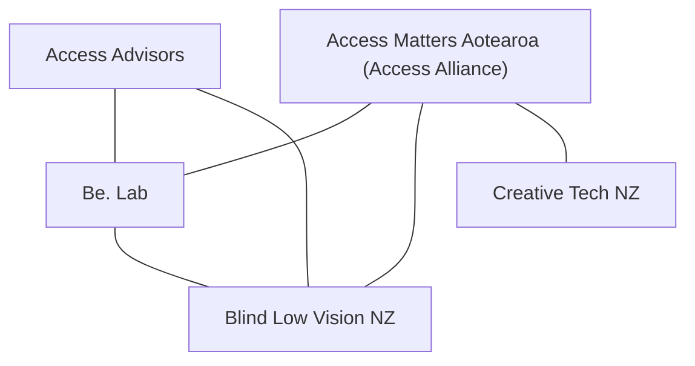

**Human Rights Tech**

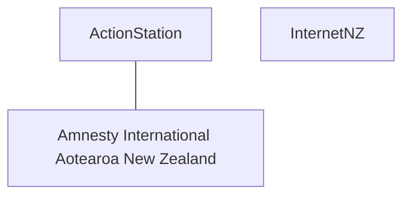

**Legal Aid & Justice Tech**

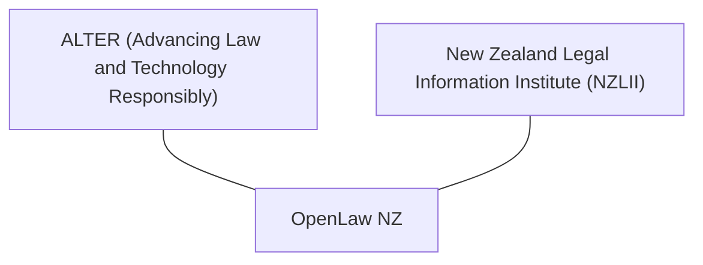

**Iwi & Māori Tech Initiatives**

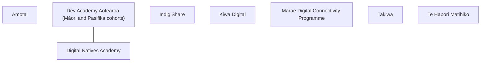

**Green & Climate Tech**

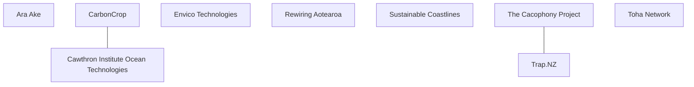

**Open Data**

```mermaid
flowchart TD
    n_AucklandCouncilOpenData["Auckland Council Open Data"]
    n_BayofPlentyRegionalCounc["Bay of Plenty Regional Council Open Data (Bay of Plenty Maps)"]
    n_ChristchurchCityCouncilO["Christchurch City Council Open Data Portal"]
    n_datagovtnz["data.govt.nz"]
    n_DigitalNZ["DigitalNZ"]
    n_DunedinCityCouncilOpenDa["Dunedin City Council Open Data"]
    n_EnvironmentCanterburyOpe["Environment Canterbury Open Data"]
    n_EnvironmentSouthlandOpen["Environment Southland Open Data"]
    n_FigureNZ["Figure.NZ"]
    n_GisborneDistrictCouncilG["Gisborne District Council Geoportal (Tairāwhiti)"]
    n_GreaterWellingtonRegiona["Greater Wellington Regional Council Open Data"]
    n_HawkesBayRegionalCouncil["Hawke's Bay Regional Council Open Data"]
    n_Koordinates["Koordinates"]
    n_LINZDataServiceToitTeWhe["LINZ Data Service (Toitū Te Whenua)"]
    n_ManaakiWhenuaLandcareRes["Manaaki Whenua Landcare Research LRIS Portal"]
    n_MarlboroughDistrictCounc["Marlborough District Council Open Data"]
    n_NelsonCityCouncilOpenDat["Nelson City Council Open Data"]
    n_NIWAEnvironmentalDataSer["NIWA Environmental Data Services"]
    n_NorthlandRegionalCouncil["Northland Regional Council Open Data"]
    n_OtagoRegionalCouncilSpat["Otago Regional Council Spatial Data Portal"]
    n_TaranakiRegionalCouncilO["Taranaki Regional Council Open Data"]
    n_TasmanDistrictCouncilGeo["Tasman District Council GeoHUB"]
    n_WaikatoOpenDataHub["Waikato Open Data Hub"]
    n_WellingtonCityCouncilOpe["Wellington City Council Open Data"]
    n_AucklandCouncilOpenData --- n_Koordinates
    n_AucklandCouncilOpenData --- n_datagovtnz
    n_DigitalNZ --- n_datagovtnz
    n_FigureNZ --- n_datagovtnz
    n_HawkesBayRegionalCouncil --- n_datagovtnz
    n_Koordinates --- n_LINZDataServiceToitTeWhe
    n_Koordinates --- n_ManaakiWhenuaLandcareRes
    n_Koordinates --- n_datagovtnz
    n_LINZDataServiceToitTeWhe --- n_ManaakiWhenuaLandcareRes
    n_LINZDataServiceToitTeWhe --- n_datagovtnz
    n_OtagoRegionalCouncilSpat --- n_datagovtnz
    n_WaikatoOpenDataHub --- n_datagovtnz
```

**Makerspaces & Hackerspaces**

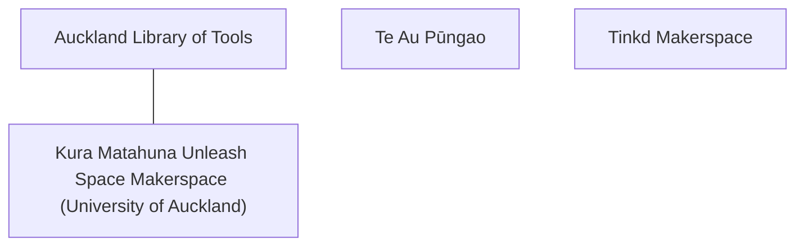

**Volunteering & Giving Platforms**

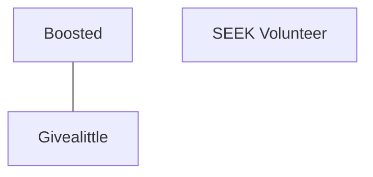

**Worker & Platform Co-ops**

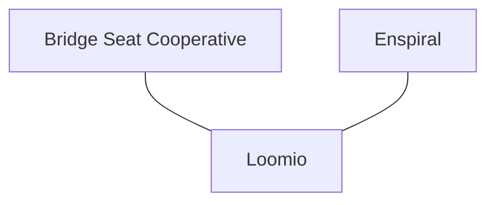

**Mental Health Tech**

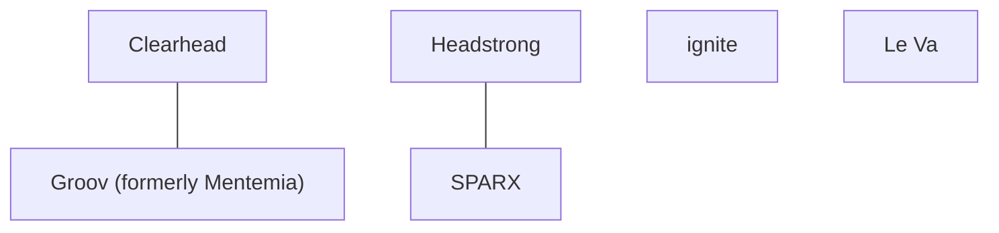

**Digital Inclusion**

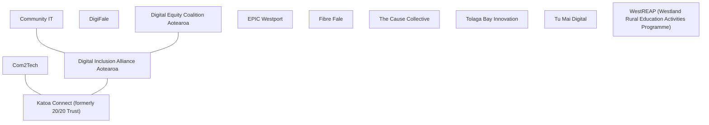

**Civic Tech**

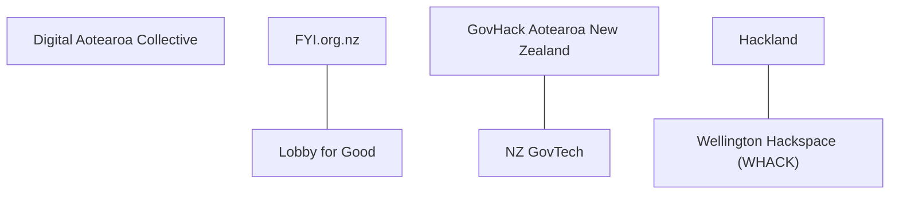

**GovTech**

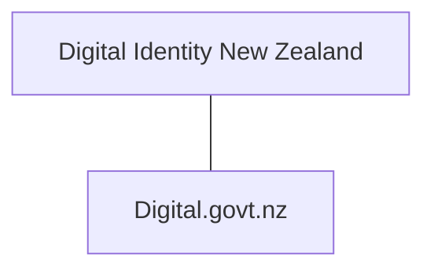

**Crisis & Humanitarian Tech**

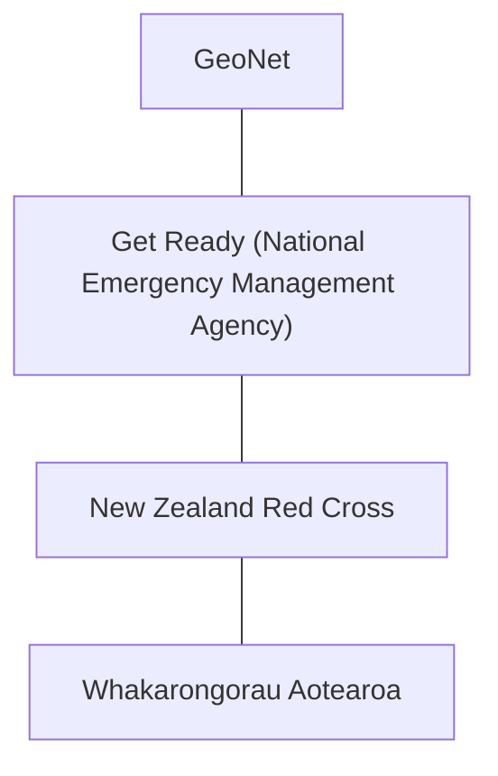

**Environmental Citizen Science**

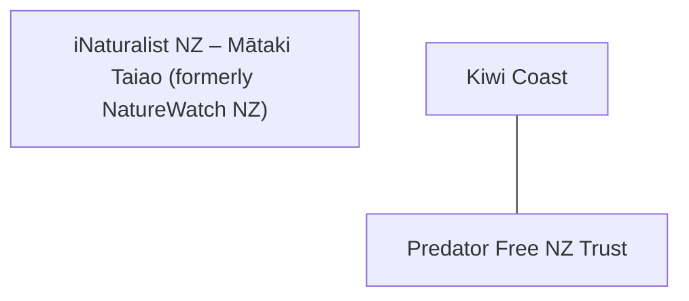

**Māori Data Sovereignty**

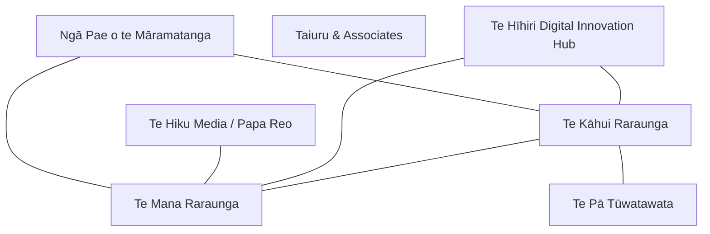

## Disability & Accessibility Tech

Tools and consultancy that make websites, services, and physical spaces usable by disabled people, and organisations advocating for that.

_5 entries in this domain._

**Access Advisors**

- Access Advisors is a New Zealand digital accessibility consultancy that helps organisations, including government agencies and banks, test and design websites and services so they work for disabled people, using a panel of disabled testers with real assistive technology.
- Region: national
- Links: [Website](https://accessadvisors.nz) · [LinkedIn](https://www.linkedin.com/company/access-advisors-nz)
- Tags: accessibility, disability, consulting, WCAG, assistive technology
- Related: Blind Low Vision NZ, Be. Lab

**Access Matters Aotearoa (Access Alliance)**

- Access Matters Aotearoa (originally the Access Alliance, formed in 2017 with support from Blind Low Vision NZ) is a coalition of disabled people's organisations campaigning for an Accessibility Act that would require services and technology across New Zealand to be accessible to disabled people.
- Region: national
- Links: [Website](https://www.accessmatters.org.nz) · [LinkedIn](https://www.linkedin.com/company/access-matters-aotearoa/)
- Tags: accessibility, disability advocacy, legislation, coalition
- Related: Blind Low Vision NZ

**Be. Lab**

- Be. Lab (formerly Be. Accessible) is a New Zealand organisation, launched in 2011, that helps businesses make their websites, apps, and workplaces accessible through digital accessibility assessments, training, and consulting.
- Region: national
- Links: [Website](https://www.belab.co.nz) · [LinkedIn](https://www.linkedin.com/company/belabnz)
- Tags: accessibility, digital accessibility, consulting, disability employment
- Related: Blind Low Vision NZ, Access Matters Aotearoa

**Blind Low Vision NZ**

- Blind Low Vision NZ (formerly the Royal New Zealand Foundation of the Blind) supports blind, deafblind, and low-vision New Zealanders, including publishing web accessibility guidelines and running an Accessible Formats Service that produces documents in Braille, large print, and audio.
- Region: national
- Links: [Website](https://blindlowvision.org.nz) · [LinkedIn](https://nz.linkedin.com/company/blind-low-vision-nz)
- Tags: accessibility, disability, WCAG, assistive technology, charity
- Related: Access Matters Aotearoa

**Creative Tech NZ**

- Creative Tech NZ, started by disability advocate Glen McMillan, shares stories and resources about how creative and assistive technology, including AI and accessible design, can help disabled children and their families learn, communicate, and take part in everyday life.
- Region: national
- Links: [Website](https://creativetechnewzealand.co.nz)
- Tags: accessibility, assistive technology, disability, children, AI
- Related: Access Matters Aotearoa (Access Alliance)

## Human Rights Tech

Digital campaigning, advocacy, and organising tools used to defend and advance human rights.

_3 entries in this domain._

**ActionStation**

- ActionStation is a New Zealand digital campaigning organisation that helps everyday people run online petitions and coordinated campaigns on issues like Te Tiriti o Waitangi (the Treaty of Waitangi), climate justice, and welfare.
- Region: wellington
- Links: [Website](https://actionstation.org.nz) · [GitHub](https://github.com/actionstation) · [LinkedIn](https://nz.linkedin.com/company/actionstation)
- Tags: digital campaigning, advocacy, petitions, Te Tiriti
- Related: Amnesty International Aotearoa New Zealand

**Amnesty International Aotearoa New Zealand**

- Amnesty International Aotearoa New Zealand is the local chapter of the global human rights movement, established in 1965, that runs online petitions, letter-writing actions, and digital campaigns on issues like refugee rights and climate justice.
- Region: auckland
- Links: [Website](https://amnesty.org.nz)
- Tags: human rights, digital campaigning, advocacy, non-profit
- Related: ActionStation

**InternetNZ**

- InternetNZ is a non-profit membership organisation that manages the .nz internet domain name system and advocates for an open, secure internet in New Zealand, including work on digital equity and online harm.
- Region: wellington
- Links: [Website](https://internetnz.nz) · [GitHub](https://github.com/InternetNZ)
- Tags: digital rights, internet policy, domain names, non-profit

## Tech Ethics & Responsible AI

Groups working on the ethical, safe, and accountable use of technology and AI, including policy research and public education.

_4 entries in this domain._

**AI Forum New Zealand**

- AI Forum New Zealand is a member organisation that brings together businesses, researchers, and government to guide artificial intelligence in New Zealand, running working groups on AI governance and a Māori AI Advisory Panel to help make sure AI is developed responsibly and inclusively.
- Region: national
- Links: [Website](https://aiforum.org.nz) · [LinkedIn](https://www.linkedin.com/company/aiforumnz/)
- Tags: responsible AI, tech ethics, industry network, AI governance
- Related: Te Mana Raraunga

**AI Safety Aotearoa**

- AI Safety Aotearoa is an independent public education initiative that explains AI risks and safety in plain language for New Zealanders, covering topics like deepfakes, data sovereignty, algorithmic bias and election integrity through explainers, research and community events.
- Region: wellington
- Links: [Website](https://www.aisafetyaotearoa.org) · [LinkedIn](https://www.linkedin.com/company/ai-safety-aotearoa)
- Tags: AI safety, AI ethics, public education, responsible AI, advocacy

**Brainbox Institute**

- Brainbox Institute is a public interest think tank and consultancy working at the intersection of law, technology and policy, best known for building and maintaining the NZ AI Policy Tracker and advising government and civil society on AI regulation, disinformation and digital governance.
- Region: national
- Links: [Website](https://www.brainbox.institute) · [LinkedIn](https://www.linkedin.com/company/brainbox-institute/)
- Tags: AI policy, think tank, law and technology, regulation, consultancy

**Centre for Artificial Intelligence and Public Policy (CAIPP)**

- CAIPP is a University of Otago research centre that studies the policy, regulation, ethics and governance implications of artificial intelligence, drawing on researchers across law, philosophy, computer science and other fields, and advising government agencies including the Department of Internal Affairs on AI-related policy.
- Region: otago
- Links: [Website](https://www.otago.ac.nz/caipp)
- Tags: AI policy, AI ethics, university research, governance, Otago

## Legal Aid & Justice Tech

Free or low-cost legal information and tools that help people understand and exercise their legal rights without a lawyer.

_3 entries in this domain._

**ALTER (Advancing Law and Technology Responsibly)**

- ALTER is a University of Auckland Law School initiative that runs a student hackathon, fellowships, and publications to build technology that improves access to legal and social support in New Zealand, while thinking carefully about the ethics of that technology.
- Region: auckland
- Links: [Website](https://www.alter.auckland.ac.nz/)
- Tags: legal tech, hackathon, university, access to justice, responsible tech
- Related: OpenLaw NZ

**New Zealand Legal Information Institute (NZLII)**

- The New Zealand Legal Information Institute is a free website, run by the law faculties of Otago, Canterbury, and Victoria University of Wellington, that gives anyone free access to New Zealand court decisions, legislation, and law journals that would otherwise cost money to search.
- Region: national
- Links: [Website](https://www.nzlii.org/)
- Tags: legal information, open access, case law, university
- Related: OpenLaw NZ

**OpenLaw NZ**

- OpenLaw NZ is a non-profit charity, started in 2018, that builds free and open-source legal research tools because New Zealand had no free way to search its own laws and court cases online.
- Region: national
- Links: [Website](https://www.openlaw.nz/our-mission)
- Tags: legal tech, open source, access to justice, non-profit

## Iwi & Māori Tech Initiatives

Technology initiatives run by or for iwi and Māori communities: digital infrastructure, connectivity, and community-led tech projects.

_8 entries in this domain._

**Amotai**

- Amotai is Aotearoa's supplier diversity intermediary, connecting public and private sector buyers with over 2,200 verified Māori and Pasifika-owned businesses, including more than 100 tech suppliers working across AI, cybersecurity, automation, and digital services. Founded in 2018 within Auckland Council, it now operates nationally, helping grow Māori and Pasifika business capability and increasing the share of procurement contracts awarded to these communities.
- Region: national
- Links: [Website](https://amotai.nz) · [LinkedIn](https://nz.linkedin.com/company/amotai)
- Tags: māori-business, pasifika-business, supplier-diversity, procurement, economic-equity

**Dev Academy Aotearoa (Māori and Pasifika cohorts)**

- Dev Academy Aotearoa is a New Zealand coding bootcamp that runs dedicated scholarships for Māori, Pasifika, and women, cutting course fees so more people from these groups can retrain as web developers, and it has graduated more than twice the share of women and Māori compared with a typical computer science degree.
- Region: national
- Links: [Website](https://devacademy.co.nz/) · [LinkedIn](https://www.linkedin.com/school/3529441)
- Tags: Māori tech, coding bootcamp, scholarships, digital skills
- Related: Digital Natives Academy

**Digital Natives Academy**

- Digital Natives Academy is a Rotorua-based charity, started in 2014, that gives young people, especially Māori rangatahi (youth), free training and access to technology in coding, robotics, animation, and game development, to help them move from using technology to creating it.
- Region: bay-of-plenty
- Links: [Website](https://digitalnatives.academy/) · [LinkedIn](https://www.linkedin.com/company/digitalnativesacademy)
- Tags: Māori tech, youth technology education, digital skills, charity
- Related: Dev Academy Aotearoa

**IndigiShare**

- IndigiShare is a kaupapa Māori fintech startup building economic resilience for indigenous communities through zero-interest peer-to-peer lending, a business development programme (Te Aka Matua), and culturally-grounded financial products powered by koha.
- Region: bay-of-plenty
- Links: [Website](https://indigishare.co.nz)
- Tags: kaupapa Māori, fintech, peer-to-peer lending, indigenous-economy, financial-inclusion

**Kiwa Digital**

- Kiwa Digital is an Auckland technology company, founded in 2003, that builds apps and cloud software helping Indigenous communities record, protect, and share their languages and cultural stories, including tools for te reo Māori.
- Region: auckland
- Links: [Website](https://kiwadigital.com/) · [GitHub](https://github.com/kiwa-digital) · [LinkedIn](https://www.linkedin.com/company/kiwa-digital/)
- Tags: Māori tech, indigenous language technology, cultural data sovereignty, startup
- Related: Te Hiku Media / Papa Reo

**Marae Digital Connectivity Programme**

- The Marae Digital Connectivity Programme gives rural marae free broadband, wifi hardware, and technical support so whānau, hapū, and iwi can hold virtual hui and reach health, social, and education services online, administered jointly by Te Puni Kōkiri, MBIE, and National Infrastructure Funding and Financing.
- Region: national
- Links: [Website](https://www.tpk.govt.nz/en/nga-putea-me-nga-ratonga/marae/marae-digital-connectivity)
- Tags: marae, broadband, digital connectivity, govtech, rural

**Takiwā**

- Takiwā is a New Zealand geospatial mapping platform, running since 2012, that lets Māori landowners, iwi, and other indigenous communities collect and control their own cultural and environmental data on interactive maps, instead of only government agencies holding that data.
- Region: national
- Links: [Website](https://www.takiwa.co/)
- Tags: Māori tech, indigenous data sovereignty, geospatial, mapping, startup
- Related: Te Kāhui Raraunga, Te Mana Raraunga

**Te Hapori Matihiko**

- Te Hapori Matihiko is a global community for Māori working in, or aspiring to work in, the digital and tech industries. Founded in 2022 by Katie Brown and Lee Timutimu with MBIE Māori Innovation funding, it provides advocacy, professional networking, and cultural support, and runs the annual Ngā Tohu Matihiko awards celebrating Māori excellence in digital and technology across Aotearoa and the world.
- Region: national
- Links: [Website](https://matihiko.nz) · [LinkedIn](https://www.linkedin.com/company/te-hapori-matihiko)
- Tags: māori-tech, digital-community, advocacy, tech-leadership, te-ao-māori

## Food Rescue & Food Security Tech

Platforms that move surplus food to people who need it, or help organisations measure and reduce food waste.

_3 entries in this domain._

**Aotearoa Food Rescue Alliance**

- The Aotearoa Food Rescue Alliance (AFRA) is the national peak body for food rescue organisations in New Zealand, providing sector coordination, shared data collection through a sector data portal, and advocacy to government on food security policy.
- Region: national
- Links: [Website](https://afra.org.nz) · [LinkedIn](https://nz.linkedin.com/company/aotearoa-food-rescue-alliance)
- Tags: food rescue, food security, advocacy, data, national

**Gone Good**

- Gone Good is a New Zealand-owned app, built by the team behind Delivereasy, that lets cafes, bakeries and restaurants sell unsold food as discounted "Mystery Bags" near closing time instead of binning it, cutting food waste and giving customers cheap meals.
- Region: national
- Links: [Website](https://www.gonegood.co.nz)
- Tags: food waste, food rescue, app, surplus food, hospitality

**Kai Commitment**

- Kai Commitment is a registered New Zealand charity running a food-waste measurement programme for large food businesses, using a Target-Measure-Act-Collaborate data framework to help signatories set reduction targets and track progress toward halving food waste by 2030.
- Region: national
- Links: [Website](https://kaicommitment.org.nz) · [LinkedIn](https://www.linkedin.com/showcase/kai-commitment/)
- Tags: food waste, data measurement, sustainability, sdg 12.3, charity

## Green & Climate Tech

Tools that measure, reduce, or help people respond to climate change and its effects, from carbon tracking to clean-energy platforms.

_9 entries in this domain._

**Ara Ake**

- Ara Ake is a New Zealand government-established energy innovation centre, based in Taranaki, that helps businesses test and commercialise new clean energy technologies.
- Region: taranaki
- Links: [Website](https://www.araake.co.nz) · [LinkedIn](https://nz.linkedin.com/company/ara-ake)
- Tags: clean energy, climate tech, government agency, innovation

**CarbonCrop**

- CarbonCrop is a New Zealand company, spun out of the Nelson AI Institute in 2020, that uses artificial intelligence and satellite imagery to help farmers and landowners measure their native forests and turn forest restoration into paid carbon credits.
- Region: tasman-nelson
- Links: [Website](https://www.carboncrop.com) · [LinkedIn](https://nz.linkedin.com/company/carboncrop)
- Tags: climate tech, carbon credits, AI, forestry, startup

**Cawthron Institute Ocean Technologies**

- Cawthron Institute, a science research institute based in Nelson, builds ocean sensors and data buoys that let mussel and salmon farmers check water conditions on their phones, and it recently spun out a company called Ocean Intelligence to sell this technology.
- Region: tasman-nelson
- Links: [Website](https://www.cawthron.org.nz/what-we-do/ocean-health/ocean-technologies/) · [GitHub](https://github.com/cawthron) · [LinkedIn](https://www.linkedin.com/company/cawthron-institute)
- Tags: ocean tech, aquaculture, remote sensors, research institute, climate tech
- Related: CarbonCrop

**Envico Technologies**

- Envico Technologies is a Tauranga-based company that builds heavy-lifting drones to help protect New Zealand's native wildlife, using them to drop pest bait and native seeds in places that are too remote or dangerous for people to reach on foot.
- Region: bay-of-plenty
- Links: [Website](https://www.envicotech.co.nz) · [LinkedIn](https://nz.linkedin.com/company/envicotech)
- Tags: climate tech, conservation tech, drones, pest control, startup

**Rewiring Aotearoa**

- Rewiring Aotearoa is a New Zealand non-profit that researches and campaigns for households and small businesses to switch from fossil-fuel machines, like petrol cars and gas heaters, to electric ones powered by renewable energy, so people save money and cut carbon emissions.
- Region: national
- Links: [Website](https://www.rewiring.nz) · [LinkedIn](https://www.linkedin.com/company/rewiring-aotearoa)
- Tags: climate tech, energy transition, electrification, advocacy, non-profit

**Sustainable Coastlines**

- Sustainable Coastlines is an Auckland-based charity that runs Litter Intelligence, New Zealand's national database of beach litter, where trained volunteers survey rubbish on beaches using a standard method so the data can be used by government to shape plastic pollution policy.
- Region: auckland
- Links: [Website](https://sustainablecoastlines.org) · [LinkedIn](https://nz.linkedin.com/company/sustainable-coastlines)
- Tags: climate tech, environmental data, citizen science, charity, plastic pollution

**The Cacophony Project**

- The Cacophony Project is a New Zealand non-profit that builds free, open-source cameras and software that use artificial intelligence to automatically spot introduced predators, like rats and stoats, so conservation workers can protect native birds more effectively.
- Region: national
- Links: [Website](https://www.cacophony.org.nz) · [GitHub](https://github.com/TheCacophonyProject) · [LinkedIn](https://www.linkedin.com/company/cacophony/)
- Tags: climate tech, conservation tech, AI, open source, non-profit, predator control

**Toha Network**

- Toha is a New Zealand technology platform that lets landowners and community groups get paid for verified environmental work, like restoring wetlands or improving water quality, by turning that work into tradeable, data-backed environmental credits.
- Region: national
- Links: [Website](https://toha.network) · [LinkedIn](https://nz.linkedin.com/company/toha-nz)
- Tags: climate tech, environmental data, regenerative economy, fintech

**Trap.NZ**

- Trap.NZ is a free app built by New Zealand company Groundtruth, with support from WWF-New Zealand, that lets community volunteers record and map where they trap pest animals like rats and possums, so more than 9,000 conservation groups can see where pests are being caught across the country.
- Region: national
- Links: [Website](https://trap.nz)
- Tags: predator control, conservation, community science, Predator Free 2050, mapping
- Related: The Cacophony Project

## Open Data

Government or organisational data published for anyone to use, and the platforms that host and serve it.

_24 entries in this domain._

**Auckland Council Open Data**

- Auckland Council Open Data is the council's public website for browsing and downloading geospatial datasets, such as maps of parks, property boundaries, and infrastructure, so residents and developers can reuse council information.
- Region: auckland
- Links: [Website](https://data-aucklandcouncil.opendata.arcgis.com/)
- Tags: open data, geospatial, local government, council
- Related: data.govt.nz, Koordinates

**Bay of Plenty Regional Council Open Data (Bay of Plenty Maps)**

- Bay of Plenty Maps is an open data site where Bay of Plenty Regional Council, Tauranga City Council, Western Bay of Plenty District Council, and Whakatāne District Council share public spatial data, like resource consents and council boundaries.
- Region: bay-of-plenty
- Links: [Website](https://data-boprc.opendata.arcgis.com/)
- Tags: regional council, open data, environment, GIS

**Christchurch City Council Open Data Portal**

- Christchurch City Council's Spatial Open Data Portal publishes public datasets about council assets, infrastructure, and planning rules, so contractors and residents can find authoritative maps of the city.
- Region: canterbury
- Links: [Website](https://opendata-christchurchcity.hub.arcgis.com/)
- Tags: city council, open data, GIS

**data.govt.nz**

- data.govt.nz is the New Zealand government's central website for finding and downloading open datasets published by government agencies, covering topics like health, education, transport, and the environment.
- Region: national
- Links: [Website](https://data.govt.nz) · [GitHub](https://github.com/data-govt-nz)
- Tags: open data, government, data catalogue, govtech
- Related: LINZ Data Service, DigitalNZ, GovHack Aotearoa

**DigitalNZ**

- DigitalNZ, run by the National Library of New Zealand, is a search service and open application programming interface (API) that brings together more than 30 million digitised items (photos, articles, and records) from over 200 New Zealand museums, libraries, and archives into one searchable place.
- Region: national
- Links: [Website](https://digitalnz.org) · [GitHub](https://github.com/DigitalNZ)
- Tags: open data, cultural heritage, API, aggregator, open source
- Related: data.govt.nz, GovHack Aotearoa

**Dunedin City Council Open Data**

- Dunedin City Council runs an open data hub where people can explore and download the council's public spatial data and build their own maps and tools with it.
- Region: otago
- Links: [Website](https://city-of-dunedin-open-data-dunedin-gis.hub.arcgis.com/)
- Tags: city council, open data, GIS

**Environment Canterbury Open Data**

- Environment Canterbury runs an open data portal where anyone can download the regional council's public information about air quality, freshwater, and resource consents in the Canterbury region.
- Region: canterbury
- Links: [Website](https://data.ecan.govt.nz/)
- Tags: regional council, open data, environment, GIS

**Environment Southland Open Data**

- Environment Southland, the Southland Regional Council, publishes open GIS data on rivers, resource consents, and monitoring sites, including live environmental data like river flows and rainfall for the Southland region.
- Region: southland
- Links: [Website](https://data-esgis.opendata.arcgis.com/)
- Tags: regional council, open data, environment, GIS

**Figure.NZ**

- Figure.NZ is a charity that publishes free, easy-to-understand data and charts about New Zealand, so anyone can find and reuse the country's numbers without needing to be a data expert.
- Region: auckland
- Links: [Website](https://figure.nz) · [GitHub](https://github.com/FigureNZ) · [LinkedIn](https://nz.linkedin.com/company/figure-nz)
- Tags: open data, data visualisation, data literacy, charity
- Related: data.govt.nz

**Gisborne District Council Geoportal (Tairāwhiti)**

- Gisborne District Council's Geoportal Data Hub lets people explore and download public spatial data for the Tairāwhiti (Gisborne) region, like parks, public toilets, and sites of geological significance.
- Region: gisborne
- Links: [Website](https://geoportal-gizzy.opendata.arcgis.com/)
- Tags: district council, open data, GIS

**Greater Wellington Regional Council Open Data**

- Greater Wellington Regional Council shares open data on air quality, rainfall, river levels, and water quality for the Wellington region, free to download or connect to as live map layers.
- Region: wellington
- Links: [Website](https://data-gwrc.opendata.arcgis.com/)
- Tags: regional council, open data, environment, GIS

**Hawke's Bay Regional Council Open Data**

- Hawke's Bay Regional Council's open data page lets people view and download council-collected data, like water quality and environmental monitoring information, for free reuse.
- Region: hawkes-bay
- Links: [Website](https://www.hbrc.govt.nz/our-council/open-data/) · [LinkedIn](https://www.linkedin.com/company/hawkes-bay-regional-council)
- Tags: open data, environmental data, local government, council
- Related: data.govt.nz

**Koordinates**

- Koordinates is an Auckland-founded company that runs a cloud platform for storing, versioning, and sharing geospatial data, and it is the technology behind the government's LINZ Data Service.
- Region: auckland
- Links: [Website](https://koordinates.com) · [GitHub](https://github.com/koordinates) · [LinkedIn](https://nz.linkedin.com/company/koordinates)
- Tags: open data, geospatial, government contractor, open source
- Related: LINZ Data Service (Toitū Te Whenua), data.govt.nz

**LINZ Data Service (Toitū Te Whenua)**

- The LINZ Data Service, run by Land Information New Zealand (a government agency, known in Māori as Toitū Te Whenua), gives free open access to New Zealand's land, property, and seabed data, including maps, aerial imagery, and elevation data.
- Region: national
- Links: [Website](https://www.linz.govt.nz/products-services/data/linz-data-service) · [GitHub](https://github.com/linz) · [LinkedIn](https://www.linkedin.com/company/toit%C5%AB-te-whenua-linz-/)
- Tags: open data, geospatial, government, mapping, open source
- Related: data.govt.nz, GovHack Aotearoa

**Manaaki Whenua Landcare Research LRIS Portal**

- The Land Resource Information System (LRIS) Portal, run by Crown research institute Manaaki Whenua Landcare Research, is a free online tool with over 200 layers of New Zealand land data, like soil types, erosion risk, and land cover, that anyone can search and download.
- Region: national
- Links: [Website](https://soils.landcareresearch.co.nz/tools/lris-portal) · [LinkedIn](https://www.linkedin.com/company/landcare-research/)
- Tags: land data, soil data, conservation, Crown research institute, open data
- Related: LINZ Data Service (Toitū Te Whenua), Koordinates

**Marlborough District Council Open Data**

- Marlborough District Council shares its public geographic data, such as property boundaries and environmental information, through an open data portal that anyone can browse and download from.
- Region: marlborough
- Links: [Website](https://data-marlborough.opendata.arcgis.com/)
- Tags: district council, open data, GIS

**Nelson City Council Open Data**

- Nelson City Council publishes its public GIS data, such as property and infrastructure information, through an ArcGIS open data portal that anyone can browse for free.
- Region: tasman-nelson
- Links: [Website](https://data2018-12-16t234104082z-nelsoncity.opendata.arcgis.com/)
- Tags: city council, open data, GIS

**NIWA Environmental Data Services**

- NIWA, now part of Earth Sciences New Zealand after a 2025 merger with GNS Science, runs online tools like the Hydro Web Portal and National Climate Database, which let people look up New Zealand's river flow, rainfall, and climate data for free.
- Region: national
- Links: [Website](https://niwa.co.nz/environmental-information/environmental-information-services-0) · [GitHub](https://github.com/niwa) · [LinkedIn](https://nz.linkedin.com/company/niwa)
- Tags: climate data, water data, open data, science institute
- Related: GeoNet

**Northland Regional Council Open Data**

- Northland Regional Council publishes an open data portal with public information, such as resource consents and land use data, for people who want to make their own maps of the Northland region.
- Region: northland
- Links: [Website](https://data-nrcgis.opendata.arcgis.com/)
- Tags: regional council, open data, environment, GIS

**Otago Regional Council Spatial Data Portal**

- The Otago Regional Council Spatial Data Portal is a website where people can discover, explore, and download the council's geographic datasets, like maps of land, water, and boundaries in the Otago region.
- Region: otago
- Links: [Website](https://orc-spatial-data-portal-orcnz.hub.arcgis.com/)
- Tags: open data, geospatial, local government, council
- Related: data.govt.nz

**Taranaki Regional Council Open Data**

- Taranaki Regional Council's open data hub lets people download public datasets and story maps about biodiversity, rivers, resource consents, and iwi boundaries in the Taranaki region.
- Region: taranaki
- Links: [Website](https://opendata-trcnz.hub.arcgis.com/)
- Tags: regional council, open data, environment, GIS

**Tasman District Council GeoHUB**

- Tasman District Council's GeoHUB is an open data catalogue where people can download the council's public GIS layers, like property and planning information, for the Tasman region.
- Region: tasman-nelson
- Links: [Website](https://geohub.tasman.govt.nz/)
- Tags: district council, open data, GIS

**Waikato Open Data Hub**

- The Waikato Open Data Hub is a website where nine councils across the Waikato region share their maps and datasets together, covering things like roads, pipes, and land boundaries, so anyone can search and download them in one place.
- Region: waikato
- Links: [Website](https://colabsolutions.govt.nz/shared-services/geospatial-projects-and-services/wodh/) · [LinkedIn](https://www.linkedin.com/company/co-labsolutions)
- Tags: open data, geospatial, local government, council
- Related: data.govt.nz

**Wellington City Council Open Data**

- Wellington City Council has published open geospatial data since 2010, including aerial photos, historic maps, building footprints, and hazard information, free for anyone to download and reuse.
- Region: wellington
- Links: [Website](https://data-wcc.opendata.arcgis.com/)
- Tags: city council, open data, GIS

## Makerspaces & Hackerspaces

Shared physical spaces with tools like 3D printers and workshops, open to the public to build, learn, and prototype.

_4 entries in this domain._

**Auckland Library of Tools**

- Auckland Library of Tools is a Grey Lynn community hub where people can borrow up to 10 tools at a time, from power drills to sewing machines, instead of buying their own, and it also runs monthly repair cafes to help people fix things rather than throw them away.
- Region: auckland
- Links: [Website](https://www.aucklandlibraryoftools.com/)
- Tags: makerspace, tool library, community tech space, sustainability, volunteer-run
- Related: Hackland

**Kura Matahuna Unleash Space Makerspace (University of Auckland)**

- Kura Matahuna Unleash Space Makerspace is a free workshop at the University of Auckland, open to all students and staff, with 3D printers, laser cutters, and electronics gear, where people learn to build and prototype their own projects after safety training.
- Region: auckland
- Links: [Website](https://www.auckland.ac.nz/en/cie/locations/unleash-space/makerspace.html) · [GitHub](https://github.com/unleash-space)
- Tags: makerspace, university, digital fabrication, prototyping, innovation hub
- Related: Hackland, Auckland Library of Tools

**Te Au Pūngao**

- Te Au Pūngao is Marlborough's technology and innovation hub in Blenheim, run by Whiringa under contract to Marlborough District Council, offering co-working space, 3D printers, soldering stations and VR headsets, plus a microgrants programme to help local start-ups take their first steps.
- Region: marlborough
- Links: [Website](https://www.teaupungao.com) · [LinkedIn](https://www.linkedin.com/company/teaupungao/)
- Tags: makerspace, coworking, innovation hub, Marlborough, microgrants

**Tinkd Makerspace**

- Tinkd Makerspace is a not-for-profit community workshop in Tauranga, run by STEM Wana Trust, where people share 3D printers, laser cutters, sewing machines, and electronics gear, and learn making and digital skills from each other at open evening and weekend sessions.
- Region: bay-of-plenty
- Links: [Website](https://tinkd.nz) · [GitHub](https://github.com/tinkdnz)
- Tags: makerspace, hackerspace, community tech space, STEM education, charity
- Related: Hackland

## Health Tech for Good / Hauora Māori

Digital health tools built for public benefit, including Māori-led and Māori-owned tech supporting hauora (holistic wellbeing).

_4 entries in this domain._

**Awa Digital**

- Awa Digital is a Māori-owned health technology company building AI-powered clinical documentation infrastructure (Tuhi) deployed within the Health NZ ecosystem, with Māori data sovereignty embedded in every layer.
- Region: national
- Links: [Website](https://awadigital.co.nz) · [LinkedIn](https://www.linkedin.com/company/awa-digital-nz)
- Tags: Māori-owned, health-tech, clinical-documentation, AI, Māori-data-sovereignty

**Health Navigator Charitable Trust**

- The Health Navigator Charitable Trust runs Healthify (NZ's largest consumer health website with over 1.1 million monthly page views), the NZ Health App Library, and the Digital Health Accreditation Pathway (DHAP) for evaluating digital health tools.
- Region: national
- Links: [Website](https://www.hnct.nz) · [LinkedIn](https://www.linkedin.com/company/health-navigator-charitable-trust)
- Tags: digital-health, health-information, health-apps, consumer-health, accreditation

**Karo**

- Karo is a Māori-owned tech company that builds digital tools for primary and community health providers and social services, including Te Pokapū (a claims and decision support system), Kotahi (client and case management for NGOs and community organisations), and Māramatanga (data insights and reporting), used across most of the primary care sector.
- Region: wellington
- Links: [Website](https://karo.co.nz)
- Tags: hauora Māori, health tech, Māori-owned, data and reporting

**Whānau Tahi**

- Whānau Tahi is a Māori-owned health and social services software company, set up by Te Whānau O Waipareira Trust to build the Whānau Tahi Navigator case management platform, and it now serves more than 100 health and social service organisations and over 100,000 patients across New Zealand, and has expanded into the Australian and North American markets.
- Region: auckland
- Links: [Website](https://www.whanautahi.com)
- Tags: hauora Māori, health tech, Māori-owned, case management

## Housing & Homelessness Tech

Tools and data systems that help people find housing, coordinate homelessness services, or understand their rights as tenants.

_3 entries in this domain._

**BenefitMe**

- BenefitMe is a free tool by the Digital Aotearoa Collective that helps New Zealanders discover their legal entitlements to benefits and social support, designed to reduce the power imbalance between people seeking help and government departments.
- Region: national
- Links: [Website](https://benefitme.nz)
- Tags: benefits, social-support, digital-inclusion, legal-rights
- Related: Digital Aotearoa Collective

**Home Steps**

- Home Steps is a free digital companion by the Vector Group Charitable Trust providing calm explainers, checklists, and NZ support signposting for whānau navigating renting, money, bills, employment, and emergency readiness ; available 24/7.
- Region: national
- Links: [Website](https://homesteps.vectorgroup.org.nz)
- Tags: housing-support, financial-literacy, digital-companion, whānau

**Renters United**

- Renters United is a renter advocacy group that campaigns for warmer, safer, and more secure rentals in Aotearoa, and it built TenancyHelp, a free tool that lets renters draft letters, look up Tenancy Tribunal decisions, and get plain-language answers about their rights when dealing with issues like rent rises or unrepaired homes.
- Region: wellington
- Links: [Website](https://rentersunited.org.nz)
- Tags: housing, tenancy, renters, advocacy

## Volunteering & Giving Platforms

Platforms that connect volunteers with organisations that need help, or make it easier to donate money, skills, or time.

_3 entries in this domain._

**Boosted**

- Boosted is Aotearoa New Zealand's arts crowdfunding platform, run by the charitable trust Arts Foundation Te Tumu Toi. It gives artists one-on-one coaching to run all-or-nothing giving campaigns, and has helped raise more than $10 million for creative projects since it launched in 2013.
- Region: national
- Links: [Website](https://www.boosted.org.nz) · [LinkedIn](https://www.linkedin.com/company/theartsnz)
- Tags: crowdfunding, giving platform, arts funding, creative sector
- Related: Givealittle

**Givealittle**

- Givealittle is a New Zealand-owned, not-for-profit crowdfunding website, owned by Perpetual Guardian, where people and charities can raise money online for personal causes, community projects, and disaster response.
- Region: auckland
- Links: [Website](https://www.givealittle.co.nz) · [LinkedIn](https://www.linkedin.com/company/givealittle)
- Tags: crowdfunding, giving platform, charity, fundraising

**SEEK Volunteer**

- SEEK Volunteer is a free, non-profit platform that matches people across Aotearoa with volunteer roles at community organisations, covering everything from food rescue to mental health to arts and culture. It has run in New Zealand since 2015, alongside SEEK's paid job listings.
- Region: national
- Links: [Website](https://seekvolunteer.co.nz) · [LinkedIn](https://www.linkedin.com/company/seek-volunteer/)
- Tags: volunteering, volunteer matching, matching platform, community

## Worker & Platform Co-ops

Technology built and owned cooperatively by the people who use or work on it, rather than by outside shareholders.

_3 entries in this domain._

**Bridge Seat Cooperative**

- Bridge Seat Cooperative is a small worker-owned group of freelance technology workers based in New Zealand who host services for the decentralised social web, aiming to keep parts of the internet run as a shared public service rather than for commercial profit.
- Region: national
- Links: [Website](https://bridgeseat.substack.com)
- Tags: worker cooperative, platform cooperative, decentralised web, freelance
- Related: Loomio

**Enspiral**

- Enspiral is a Wellington-founded network of people and social enterprises who support each other to do work that helps society, and it is the community that the decision-making tool Loomio originally grew out of.
- Region: wellington
- Links: [Website](https://www.enspiral.com) · [GitHub](https://github.com/enspiral) · [LinkedIn](https://nz.linkedin.com/company/enspiral)
- Tags: social enterprise network, cooperative, incubator, collective
- Related: Loomio

**Loomio**

- Loomio is a Wellington-based worker-owned cooperative that builds open-source software helping groups, from community organisations to unions, discuss a topic and reach a collective decision online.
- Region: wellington
- Links: [Website](https://www.loomio.com) · [GitHub](https://github.com/loomio)
- Tags: worker cooperative, decision-making, open source, civic tech
- Related: Enspiral

## Research & Education Tech

Research institutions and platforms studying or supporting technology's role in society, and education programmes about it.

_6 entries in this domain._

**Catalyst IT**

- Catalyst IT is a New Zealand-owned open-source software company, founded in Wellington in 1997, that builds and supports open-source systems for education (such as Moodle) and libraries (such as Koha), and does significant work for the public sector.
- Region: wellington
- Links: [Website](https://www.catalyst.net.nz) · [GitHub](https://github.com/catalyst) · [LinkedIn](https://nz.linkedin.com/company/catalyst-it-limited)
- Tags: open source, education technology, library systems, government contractor
- Related: Digital.govt.nz

**KiwiNet (Kiwi Innovation Network)**

- KiwiNet is a network of 14 New Zealand universities and research organisations that funds early-stage research and helps scientists turn discoveries into real-world products, patents, and startup companies.
- Region: national
- Links: [Website](https://kiwinet.org.nz) · [LinkedIn](https://nz.linkedin.com/company/kiwinetnz)
- Tags: research commercialisation, university network, innovation funding, startups
- Related: Ara Ake

**Koi Tū – Centre for Informed Futures**

- Koi Tū is an independent research centre at the University of Auckland that studies big, long-term problems facing New Zealand, like technology's impact on society, and turns that research into policy advice.
- Region: auckland
- Links: [Website](https://informedfutures.org) · [LinkedIn](https://www.linkedin.com/company/koi-tu-centre-for-informed-futures/)
- Tags: policy research, future of technology, University of Auckland, think tank

**REANNZ**

- REANNZ (Research and Education Advanced Network New Zealand) is a Crown-owned non-profit that runs New Zealand's high-speed internet network dedicated to universities, research institutes, and schools, connecting them to more than 120 similar networks worldwide.
- Region: national
- Links: [Website](https://www.reannz.co.nz) · [GitHub](https://github.com/reannz) · [LinkedIn](https://nz.linkedin.com/company/reannz)
- Tags: research network, education infrastructure, Crown entity, connectivity

**Te Pūnaha Matatini**

- Te Pūnaha Matatini is a research centre that studies complex systems, like disease spread, ecosystems, and social networks, to help New Zealand understand and respond to big interconnected challenges.
- Region: auckland
- Links: [Website](https://www.tepunahamatatini.ac.nz) · [LinkedIn](https://www.linkedin.com/company/te-punaha-matatini/)
- Tags: complex systems research, data science, Centre of Research Excellence, University of Auckland

**Tātai Aho Rau Core Education**

- Tātai Aho Rau Core Education is a Christchurch-founded, charity-registered social enterprise that has worked since 2003 on educational research, teacher professional development, and free digital resources like the LEARNZ virtual field trips for New Zealand schools.
- Region: canterbury
- Links: [Website](https://core-ed.org) · [GitHub](https://github.com/core-ed) · [LinkedIn](https://nz.linkedin.com/company/tatai-aho-rau-core-education)
- Tags: education technology, research, teacher training, charity

## Mental Health Tech

Digital tools that support mental health and wellbeing, from self-help apps to platforms connecting people with support.

_6 entries in this domain._

**Clearhead**

- Clearhead is a New Zealand company, built with clinical experts, that gives workplaces a digital mental health platform with self-help tools, staff wellbeing data, and access to therapy sessions in person, online, or after hours.
- Region: national
- Links: [Website](https://www.myclearhead.com)
- Tags: mental health, employee wellbeing, digital health, startup
- Related: Groov (formerly Mentemia)

**Groov (formerly Mentemia)**

- Groov is a New Zealand mental health app, started in 2018 by former All Black Sir John Kirwan and tech entrepreneur Adam Clark under the name Mentemia, that gives people simple daily tools like mindfulness exercises and mood tracking to look after their mental wellbeing.
- Region: national
- Links: [Website](https://www.groovnow.com)
- Tags: mental health, wellbeing app, corporate wellbeing, startup
- Related: Whakarongorau Aotearoa

**Headstrong**

- Headstrong is a free mental health app for NZ teenagers developed by the University of Auckland alongside rangatahi, using chatbot guides to deliver evidence-based psychological skills grounded in Te Whare Tapa Whā, funded by Health NZ.
- Region: national
- Links: [Website](https://www.headstrong.org.nz) · [LinkedIn](https://www.linkedin.com/company/headstrongnz/)
- Tags: youth-mental-health, chatbot, CBT, Te-Whare-Tapa-Whā, digital-therapeutics
- Related: SPARX

**ignite**

- ignite is a digital wellbeing platform connecting individuals and organisations to mental health and wellbeing support across NZ ; offering counsellors, psychologists, and holistic practitioners bookable online with no referral or waitlist, including a free rural wellbeing programme with Farmlands and the Rural Support Trust.
- Region: national
- Links: [Website](https://ignite.org.nz)
- Tags: wellbeing-platform, mental-health, telehealth, rural-health, counselling

**Le Va**

- Le Va is a Pasifika-led organisation that runs Aunty Dee, a free online structured problem-solving tool for Pasifika young people, alongside community-led suicide prevention programmes that have engaged over 590,000 people across Aotearoa.
- Region: auckland
- Links: [Website](https://www.leva.co.nz) · [LinkedIn](https://www.linkedin.com/company/le-va-pasifika/)
- Tags: Pasifika, youth-mental-health, suicide-prevention, digital-tool, community-led

**SPARX**

- SPARX is a free self-help game, built by the University of Auckland, that teaches young people cognitive behavioural therapy skills to manage depression and anxiety through a fantasy quest storyline, available online and as a mobile app.
- Region: auckland
- Links: [Website](https://www.sparx.org.nz)
- Tags: youth mental health, digital therapy, CBT, gaming, research

## Education Equity Tech

Tech that closes gaps in education: devices, coding programmes, and digital skills training for learners who wouldn't otherwise get them.

_5 entries in this domain._

**Code 4 Change NZ**

- Code 4 Change NZ is a charity that delivers free coding, robotics, and 3D design and printing programmes to South Auckland primary schools, working to close the digital equity gap for Māori, Pacific, and other underserved tamariki who miss out on tech and STEM education because of cost or access barriers.
- Region: auckland
- Links: [Website](https://code4changenz.org)
- Tags: coding education, STEM, Māori, Pasifika, South Auckland, digital equity

**Digital Future Aotearoa**

- Digital Future Aotearoa is a Christchurch-based charitable trust (CC51617) that runs Code Club Aotearoa, a national network of free coding clubs for children, and the Recycle a Device programme, which refurbishes donated laptops for students who cannot afford a device.
- Region: canterbury
- Links: [Website](https://www.digitalfutureaotearoa.nz) · [LinkedIn](https://nz.linkedin.com/company/digital-future-aotearoa)
- Tags: coding education, digital inclusion, device recycling, youth, christchurch
- Related: Digital Natives Academy

**Manaiakalani Education Trust**

- Manaiakalani Education Trust is an Auckland-based charity that runs a digital learning programme for schools in lower-income communities, giving students devices and teachers training so technology helps close, rather than widen, the education gap for Māori and Pacific students.
- Region: auckland
- Links: [Website](https://www.manaiakalani.org) · [LinkedIn](https://www.linkedin.com/company/manaiakalani-education-trust)
- Tags: education equity, digital learning, charity, Māori and Pacific education
- Related: Dev Academy Aotearoa (Māori and Pasifika cohorts), Digital Natives Academy

**Pūhoro STEMM Academy**

- Pūhoro STEMM Academy supports Māori secondary school students (rangatahi) into science, technology, engineering, mathematics, and mātauranga (STEMM) pathways. Founded in 2016 at Massey University in Palmerston North, it delivers kaupapa Māori mentoring, tutoring, and wānanga across 12 regions, improving academic achievement and building pathways into high-value STEMM careers for rangatahi who would otherwise be under-represented in these fields.
- Region: national
- Links: [Website](https://www.puhoro.org.nz) · [LinkedIn](https://nz.linkedin.com/company/p%C5%ABhoro)
- Tags: kaupapa-māori, stemm, rangatahi, science-pathways, education

**Summer of Tech**

- Summer of Tech is a New Zealand charitable programme that connects students and junior tech talent with employers through internships and mentoring, helping people get their first step into a tech career.
- Region: national
- Links: [Website](https://www.summeroftech.co.nz) · [GitHub](https://github.com/summeroftech) · [LinkedIn](https://www.linkedin.com/company/summer-of-tech)
- Tags: internships, tech careers, talent pipeline, charity
- Related: Dev Academy Aotearoa

## Nonprofit & NGO Tech

Software, consultancies, and infrastructure built specifically to serve nonprofits and NGOs.

_2 entries in this domain._

**Collaborate**

- Collaborate is a New Zealand volunteering app that matches people's skills and interests to volunteer roles at non-profit and community organisations, and has been used by groups including New Zealand Red Cross.
- Region: national
- Links: [Website](https://www.letscollaborate.co.nz) · [LinkedIn](https://www.linkedin.com/company/collaboratenz)
- Tags: volunteering, nonprofit tech, matching platform, app
- Related: New Zealand Red Cross

**Tech for Good New Zealand**

- A free, volunteer-run meetup community for anyone interested in using technology for social good in Aotearoa. Part of the global NetSquared network, it brings together charities, community groups, social enterprises, tech professionals, and digital marketers at regular events.
- Region: auckland
- Links: [Website](https://www.meetup.com/tech-for-good-new-zealand/) · [Events](https://www.meetup.com/tech-for-good-new-zealand/events/)
- Tags: community, meetup, netsquared, networking

## Digital Inclusion

Helping people who are shut out of the digital world get online, get devices, and build the skills and confidence to use them.

_12 entries in this domain._

**Com2Tech**

- Com2Tech is a volunteer-led community trust in Dunedin that provides free digital skills classes, low-cost refurbished devices, and community tech support to help people of all ages get online, including dedicated programmes for seniors and job-seekers.
- Region: otago
- Links: [Website](https://www.com2.tech) · [LinkedIn](https://www.linkedin.com/company/com2tech)
- Tags: digital inclusion, device recycling, community tech, seniors, dunedin
- Related: Katoa Connect (formerly 20/20 Trust)

**Community IT**

- Community IT is a community-based project that provides access to digital technology for those who would otherwise go without ; accepting device donations, running free tech repair workshops, donating repaired equipment, and offering subsidised Skinny Jump broadband as a DIAA Industry Partner.
- Region: national
- Links: [Website](https://communityit.org.nz)
- Tags: digital-inclusion, device-donation, tech-repair, broadband, community-workshops
- Related: Digital Inclusion Alliance Aotearoa

**DigiFale**

- DigiFale is an intergenerational digital health literacy programme for Pacific communities, training young "navigators" to teach their elders how to use phones and online health services with confidence, starting in a Niue community in Māngere in 2020.
- Region: auckland
- Links: [Website](https://digifale.com)
- Tags: Pasifika, digital inclusion, digital health literacy, intergenerational, community navigators

**Digital Equity Coalition Aotearoa**

- The Digital Equity Coalition Aotearoa (DECA) connects and supports the digital inclusion community in Aotearoa, shining a light on initiatives, identifying gaps, advocating, and offering space for collaboration ; working toward digital equity for every Kiwi.
- Region: national
- Links: [Website](https://digitalequity.nz) · [LinkedIn](https://linkedin.com/company/digital-equity-coalition-aotearoa)
- Tags: digital-inclusion, digital-equity, coalition, advocacy, connectivity
- Related: Digital Inclusion Alliance Aotearoa

**Digital Inclusion Alliance Aotearoa**

- Digital Inclusion Alliance Aotearoa is a Wellington-based charity that runs a federated network of more than 300 local partner organisations across New Zealand, delivering programmes like Digital Steps and Digi-Coaches so more people can get online, build digital skills, and find work.
- Region: wellington
- Links: [Website](https://digitalinclusionalliance.nz) · [LinkedIn](https://nz.linkedin.com/company/digital-inclusion-alliance-aotearoa)
- Tags: digital inclusion, digital skills, charity, federated network, community partnerships
- Related: Katoa Connect (formerly 20/20 Trust)

**EPIC Westport**

- EPIC Westport is a Buller innovation hub and business incubator offering digital literacy workshops, mentoring and co-working space, set up to help the region's economy diversify into digital industries after major local job losses at Solid Energy and Holcim Cement.
- Region: west-coast
- Links: [Website](https://www.epicwestport.co.nz) · [LinkedIn](https://www.linkedin.com/company/epic-westport)
- Tags: digital literacy, business incubator, coworking, regional development, West Coast

**Fibre Fale**

- Fibre Fale is a Pasifika-led social enterprise creating pathways into the technology industry for Pacific people in Aotearoa. Founded in 2022, it delivers events, mentoring programmes, and free AI literacy resources (including the 'AI with Eteroa' online course), with a goal of equal Pasifika representation in the NZ tech workforce by 2042.
- Region: auckland
- Links: [Website](https://www.fibrefale.com) · [LinkedIn](https://www.linkedin.com/company/fibre-fale)
- Tags: pasifika, digital-inclusion, tech-pathways, ai-literacy, social-enterprise

**Katoa Connect (formerly 20/20 Trust)**

- Katoa Connect, previously known as the 20/20 Trust, is a New Zealand charity that helps adults build everyday digital skills, like online banking and job applications, so the more than 800,000 New Zealand adults who currently lack these skills are not left behind.
- Region: national
- Links: [Website](https://www.katoaconnect.org.nz) · [LinkedIn](https://www.linkedin.com/company/katoaconnect/)
- Tags: digital inclusion, digital skills, charity, adult education

**The Cause Collective**

- The Cause Collective is a South Auckland charitable organisation that runs a Creative and Tech Hub and a mobile tech van, giving rangatahi Maori and Pasifika free hands-on technology training, device access, and pathways into the tech sector.
- Region: auckland
- Links: [Website](https://www.thecausecollective.org.nz) · [LinkedIn](https://nz.linkedin.com/company/the-cause-collective-nz)
- Tags: digital inclusion, maori, pasifika, youth tech, south auckland

**Tolaga Bay Innovation**

- Tolaga Bay Innovation runs a co-working and technology hub in Uawa (Tolaga Bay) offering digital skills training, business mentorship and seed funding to grassroots and Māori entrepreneurs, and is part of the Te Tairāwhiti Digital Equity Collective helping set up tech hubs from Hicks Bay to Wairoa.
- Region: gisborne
- Links: [Website](https://www.tbict.org)
- Tags: digital equity, rural, Māori entrepreneurship, tech hub, East Coast

**Tu Mai Digital**

- Tu Mai Digital works with community organisations to help the most vulnerable connect and navigate the digital economy ; providing affordable internet connectivity, devices, training, and guidance, operating under the Poutiri Trust umbrella.
- Region: national
- Links: [Website](https://tumaidigital.org.nz) · [LinkedIn](https://www.linkedin.com/company/tu-mai-digital/)
- Tags: digital-inclusion, connectivity, devices, digital-literacy, community

**WestREAP (Westland Rural Education Activities Programme)**

- WestREAP is a not-for-profit based in Hokitika that has run adult and community education across the West Coast for more than 40 years, including digital literacy workshops that help isolated communities, like Runanga, learn everyday technology skills such as Wi-Fi calling to stay in touch with whanau.
- Region: west-coast
- Links: [Website](https://www.westreap.org.nz) · [LinkedIn](https://www.linkedin.com/company/westreap/)
- Tags: digital inclusion, digital literacy, rural education, charity, adult education

## Civic Tech

Tools that help people take part in how their communities and government work: petitions, submissions, participatory budgeting, and ways to hold decision-makers to account.

_7 entries in this domain._

**Digital Aotearoa Collective**

- A civil society initiative connecting people across Aotearoa New Zealand who want to use technology and digital tools for the public good. Runs an open Slack community and a GitHub organisation for collaborative projects.
- Region: national
- Links: [Website](https://github.com/digitalaotearoa) · [GitHub](https://github.com/digitalaotearoa) · [Community](https://digitalaotearoa.github.io/chat/)
- Tags: community, slack, open source, civil society

**FYI.org.nz**

- FYI.org.nz is a free platform that helps anyone in New Zealand make Official Information Act requests to over 3,184 public authorities ; publishing all requests and responses online so the public can see what information has been released, with over 34,500 requests made.
- Region: national
- Links: [Website](https://fyi.org.nz)
- Tags: civic-tech, OIA, transparency, open-government, freedom-of-information
- Related: data.govt.nz

**GovHack Aotearoa New Zealand**

- GovHack is an annual 46-hour hackathon held across Australia and New Zealand where teams build projects using open government data, run in NZ cities including Auckland, Wellington, Christchurch, and Dunedin.
- Region: national
- Links: [Website](https://www.govhack.org) · [GitHub](https://github.com/GovHackNZ) · [LinkedIn](https://nz.linkedin.com/company/govhack)
- Tags: hackathon, open data, civic tech, volunteer-run
- Related: data.govt.nz, DigitalNZ, LINZ Data Service

**Hackland**

- Hackland is a volunteer-run community makerspace in Grey Lynn, Auckland, where members share tools like 3D printers, laser cutters, and woodworking and metalworking equipment, and learn skills from each other at weekly open evenings.
- Region: auckland
- Links: [Website](https://hackland.nz) · [GitHub](https://github.com/HakLand)
- Tags: makerspace, hackerspace, community tech space, volunteer-run
- Related: Tinkd Makerspace

**Lobby for Good**

- Lobby for Good is NZ's first member-funded civic portal, helping everyday people understand public decisions, keep paper trails, spot patterns, and push for change ; building shared civic infrastructure to close the lobbying transparency gap in New Zealand.
- Region: national
- Links: [Website](https://www.lobbyforgood.co.nz)
- Tags: civic-tech, transparency, lobbying, public-participation, accountability
- Related: FYI.org.nz

**NZ GovTech**

- NZ GovTech is a Wellington-based volunteer community group, with nearly 1,000 members, that brings together public servants and technologists to talk about open government, civic innovation, and using technology to solve public problems.
- Region: wellington
- Links: [Website](https://www.meetup.com/nzgovtech/)
- Tags: civic tech, open government, community group, meetup
- Related: GovHack Aotearoa New Zealand

**Wellington Hackspace (WHACK)**

- WHACK, or Wellington Hackspace, is a member-run community workshop in Wellington where people share tools like 3D printers, laser cutters, and CNC machines, and learn making and electronics skills from each other.
- Region: wellington
- Links: [Website](https://whack.nz)
- Tags: makerspace, hackerspace, community tech space, volunteer-run
- Related: Hackland

## GovTech

Software and data services built for or by government agencies, used to run public services or open government data to the public.

_2 entries in this domain._

**Digital Identity New Zealand**

- Digital Identity New Zealand brings together government, business, and community groups working on digital identity, so that New Zealanders can prove who they are online in ways that are open, trustworthy, and work well together.
- Region: national
- Links: [Website](https://digitalidentity.nz) · [LinkedIn](https://www.linkedin.com/company/digitalidnz/)
- Tags: digital identity, digital trust, industry association, govtech
- Related: Digital.govt.nz

**Digital.govt.nz**

- Digital.govt.nz is the New Zealand government's hub for digital transformation guidance, standards, and case studies, including work formerly run by the Department of Internal Affairs' Service Innovation Lab (which closed after several years of running government innovation projects).
- Region: national
- Links: [Website](https://www.digital.govt.nz)
- Tags: govtech, digital government, standards, service design
- Related: data.govt.nz

## Crisis & Humanitarian Tech

Technology used during emergencies and disasters: coordinating relief, sharing warnings, and helping people find help fast when it matters most.

_4 entries in this domain._

**GeoNet**

- GeoNet is New Zealand's natural hazard monitoring system, run by GNS Science with government partners, using over 1,000 sensors to provide free, real-time open data on earthquakes, volcanoes, tsunamis, and landslides.
- Region: national
- Links: [Website](https://www.geonet.org.nz) · [GitHub](https://github.com/GeoNet)
- Tags: disaster monitoring, open data, earthquakes, science agency
- Related: data.govt.nz

**Get Ready (National Emergency Management Agency)**

- Get Ready is the New Zealand government's National Emergency Management Agency website that helps people prepare for disasters like earthquakes and floods, including information on the Emergency Mobile Alert system that broadcasts warnings straight to phones without needing an app.
- Region: national
- Links: [Website](https://getready.govt.nz) · [LinkedIn](https://www.linkedin.com/company/national-emergency-management-agency)
- Tags: disaster preparedness, government agency, emergency alerts, civil defence
- Related: GeoNet, New Zealand Red Cross

**New Zealand Red Cross**

- New Zealand Red Cross runs the free Hazard App, downloaded over 200,000 times, which sends official emergency warnings and step-by-step guidance to help people prepare for and get through disasters.
- Region: national
- Links: [Website](https://www.redcross.org.nz) · [LinkedIn](https://nz.linkedin.com/company/new-zealand-red-cross)
- Tags: disaster response, emergency app, humanitarian, NGO
- Related: Collaborate

**Whakarongorau Aotearoa**

- Whakarongorau Aotearoa (formerly Homecare Medical) is New Zealand's government-funded telehealth provider, running free 24/7 phone and text services like Healthline and the 1737 Need to Talk mental health line for millions of callers a year.
- Region: national
- Links: [Website](https://whakarongorau.nz) · [LinkedIn](https://nz.linkedin.com/company/whakarongorau-new-zealand)
- Tags: telehealth, crisis line, mental health, government-funded
- Related: New Zealand Red Cross

## Environmental Citizen Science

Tools that let everyday people help track and protect the environment: counting birds, mapping pests, monitoring waterways, and more.

_3 entries in this domain._

**iNaturalist NZ – Mātaki Taiao (formerly NatureWatch NZ)**

- iNaturalist NZ – Mātaki Taiao, run by the New Zealand Bio-Recording Network Trust, is a website and app where anyone can record sightings of plants, animals, and fungi, helping scientists track new and spreading species across the country; it started in 2006 as NatureWatch NZ and rebranded in 2018.
- Region: national
- Links: [Website](https://www.inaturalist.nz)
- Tags: citizen science, biodiversity, conservation, open data
- Related: The Cacophony Project, Trap.NZ

**Kiwi Coast**

- Kiwi Coast Trust links more than 270 community, hapu, and iwi-led pest control groups along 291 kilometres of Northland coastline, coordinating them with AI-enabled traps, radio-tagged kiwi tracking, and shared data tools so volunteers can build New Zealand's first kiwi corridor.
- Region: northland
- Links: [Website](https://kiwicoast.org.nz)
- Tags: conservation, citizen science, predator control, community network, kiwi recovery
- Related: Predator Free NZ Trust, Trap.NZ

**Predator Free NZ Trust**

- Predator Free NZ Trust mobilises communities across the country to trap invasive predators and protect native wildlife, using a national map, trail cameras, and data tools so volunteers can track and coordinate their conservation efforts.
- Region: national
- Links: [Website](https://predatorfreenz.org) · [LinkedIn](https://www.linkedin.com/company/predatorfreenz/)
- Tags: conservation, citizen science, predator control, community mapping
- Related: Trap.NZ, The Cacophony Project

## Māori Data Sovereignty

Making sure Māori data, about Māori people, land, and taonga, stays under Māori control and governance, instead of being held or used by others without consent.

_7 entries in this domain._

**Ngā Pae o te Māramatanga**

- Ngā Pae o te Māramatanga is Aotearoa's only Māori Centre of Research Excellence, funding and coordinating research across universities to grow Māori scholarship and support Māori futures.
- Region: auckland
- Links: [Website](https://www.maramatanga.ac.nz)
- Tags: Māori research, Centre of Research Excellence, indigenous scholarship, University of Auckland
- Related: Te Mana Raraunga, Te Kāhui Raraunga

**Taiuru & Associates**

- Taiuru & Associates is a New Zealand consultancy specialising in Māori data sovereignty, AI governance, and responsible emerging technology. It advises iwi, government agencies, and private organisations on tikanga Māori and digital systems, producing widely cited frameworks, Te Tiriti-based AI ethical principles, and policy guidance to protect Māori rights in the data and AI age.
- Region: national
- Links: [Website](https://www.taiuru.co.nz)
- Tags: māori-data-sovereignty, ai-governance, responsible-ai, tech-ethics, indigenous-rights

**Te Hiku Media / Papa Reo**

- Te Hiku Media is a Northland-based iwi (tribal) radio and media organisation whose Papa Reo project builds speech-recognition and language technology for te reo Māori, while keeping ownership of the language data with the Māori community that provided it.
- Region: northland
- Links: [Website](https://papareo.nz) · [GitHub](https://github.com/TeHikuMedia) · [LinkedIn](https://www.linkedin.com/company/te-hiku-media/)
- Tags: Māori data sovereignty, language technology, speech recognition, te reo Māori, open source
- Related: Te Mana Raraunga

**Te Hīhiri Digital Innovation Hub**

- Te Hīhiri Digital Innovation Hub, run by Te Matarau a Maui in the Wellington region, supports Māori entrepreneurs and technologists through five local hubs, offering mentoring and access to funding and networks so tech businesses can grow in a way grounded in Māori values.
- Region: wellington
- Links: [Website](https://tematarau.co.nz/programmes/te-hihiri-digital-innovation-hub)
- Tags: Māori tech, digital innovation hub, entrepreneurship, regional network
- Related: Te Mana Raraunga, Te Kāhui Raraunga

**Te Kāhui Raraunga**

- Te Kāhui Raraunga is an independent charitable trust, set up in 2019 to carry out the work of the Data Iwi Leaders Group, that builds tools like the Te Whata data platform so iwi, hapū, and whānau Māori can collect, govern, and use their own data.
- Region: national
- Links: [Website](https://www.kahuiraraunga.io)
- Tags: Māori data sovereignty, indigenous rights, data governance, charitable trust
- Related: Te Mana Raraunga

**Te Mana Raraunga**

- Te Mana Raraunga is the Māori Data Sovereignty Network, founded in 2015, which advocates for data about Māori people to be governed by Māori themselves, and helped start the wider global Indigenous data sovereignty movement.
- Region: national
- Links: [Website](https://www.temanararaunga.maori.nz)
- Tags: Māori data sovereignty, indigenous rights, data governance, network
- Related: Te Hiku Media

**Te Pā Tūwatawata**

- Te Pā Tūwatawata is Aotearoa's first decentralised, Māori-owned data storage network, letting marae, hapū, iwi, and other Māori organisations store their data on New Zealand-owned infrastructure under their own tikanga rather than on foreign-owned cloud servers.
- Region: national
- Links: [Website](https://tepatuwatawata.io)
- Tags: Māori data sovereignty, data storage, decentralised infrastructure, tikanga, open source
- Related: Te Kāhui Raraunga

## Financial Inclusion & Fintech for Good

Tools that help people who are excluded from mainstream banking manage money, build savings, or access fair credit.

_1 entry in this domain._

**Sorted**

- Sorted is a free money guidance platform run by Te Ara Ahunga Ora Retirement Commission that gives New Zealanders budgeting tools, debt, KiwiSaver and retirement calculators, and a free automated savings app, to lift financial capability nationwide.
- Region: national
- Links: [Website](https://sorted.org.nz) · [LinkedIn](https://nz.linkedin.com/company/retirement-commission)
- Tags: financial literacy, budgeting, KiwiSaver, government service, financial capability

## How this is maintained / how to add an entry

This guide is generated from the YAML files in `data/entries/`, one file per entry. See [CONTRIBUTING.md](CONTRIBUTING.md) for the full step-by-step walkthrough. In short:

1. Copy `data/entry.template.yaml` to `data/entries/<slug>.yaml`.
2. Fill in the fields, verifying each against a live source.
3. Run `python3 scripts/validate.py` to check it against the schema.
4. Run `python3 scripts/build_guide.py` to regenerate this file, then open a pull request.

Entries are only added once verified against a live source. If you spot something out of date, check the entry's `source` field first, then update the YAML file in `data/entries/`.

