# New Zealand Tech-for-Good Guide

This is a living directory of New Zealand organisations, projects, networks, and people who use technology for public good: open data, civic tech, climate tech, accessibility, Māori data sovereignty, humanitarian response, and more.

**Who this is for:** people looking for NZ tech-for-good groups to work with, volunteer with, learn from, or connect to each other.

**How this guide is built:** it's generated from the YAML entries in `data/entries/`. Accuracy comes first: an entry is only added once its website (or another reliable source) confirms the details. This is a work in progress. It will grow, and some links or details may go out of date over time. See [CONTRIBUTING.md](CONTRIBUTING.md) to add or fix an entry.

## How to read this

Entries are grouped by **domain**: the area of public good the organisation works in. Each entry is a short, plain-language block: what the organisation does, where it's based, its links, and its tags. Where two entries are linked (for example, one runs on another's data, or they grew out of the same network), that connection is shown as a line in the diagrams below. No connection is invented: a line only appears if it's recorded in the underlying data.

**Legend: domains in this guide**

- **Disability & Accessibility Tech** (disability & accessibility tech): 5 entries
- **Human Rights Tech** (human-rights tech): 4 entries
- **Tech Ethics & Responsible AI** (tech-ethics / responsible-AI): 1 entry
- **Legal Aid & Justice Tech** (legal-aid / justice tech): 7 entries
- **Iwi & Māori Tech Initiatives** (iwi / Māori tech initiatives): 6 entries
- **Food Rescue & Food Security Tech** (food-rescue / food-security tech): 5 entries
- **Refugee & Migrant Support Tech** (refugee / migrant support tech): 6 entries
- **Green & Climate Tech** (green / climate-tech): 11 entries
- **GovTech** (govtech): 4 entries
- **Open Data** (open-data): 24 entries
- **Makerspaces & Hackerspaces** (makerspaces / hackerspaces): 2 entries
- **Environmental Citizen Science** (environmental citizen-science): 3 entries
- **Worker & Platform Co-ops** (worker-coop / platform-coop tech): 4 entries
- **Research & Education Tech** (research / education tech): 6 entries
- **Mental Health Tech** (mental-health tech): 2 entries
- **Nonprofit & NGO Tech** (nonprofit / NGO tech): 4 entries
- **Digital Inclusion** (digital-inclusion): 4 entries
- **Housing & Homelessness Tech** (housing / homelessness tech): 1 entry
- **Education Equity Tech** (education equity tech): 4 entries
- **Crisis & Humanitarian Tech** (crisis / humanitarian-tech): 4 entries
- **Volunteering & Giving Platforms** (volunteering / giving platforms): 1 entry
- **Financial Inclusion & Fintech for Good** (financial-inclusion / fintech-for-good): 2 entries
- **Civic Tech** (civic-tech): 5 entries
- **Health Tech for Good / Hauora Māori** (health tech for good / hauora Māori): 1 entry
- **Disability Employment Tech** (disability employment tech): 2 entries
- **Journalism & Media Tech** (journalism / media-tech): 3 entries
- **Māori Data Sovereignty** (Māori data sovereignty / indigenous data): 6 entries

**Total entries: 127, across 27 domains.**

## Ecosystem overview

This diagram shows the domains as nodes, sized by how many entries each holds, with a line drawn between two domains whenever at least one entry in one domain lists an entry in the other as related. Domains with no cross-domain links are shown on their own.

```mermaid
flowchart TD
    d0["Disability & Accessibility Tech<br/>(5 entries)"]
    d1["Human Rights Tech<br/>(4 entries)"]
    d2["Tech Ethics & Responsible AI<br/>(1 entry)"]
    d3["Legal Aid & Justice Tech<br/>(7 entries)"]
    d4["Iwi & Māori Tech Initiatives<br/>(6 entries)"]
    d5["Food Rescue & Food Security Tech<br/>(5 entries)"]
    d6["Refugee & Migrant Support Tech<br/>(6 entries)"]
    d7["Green & Climate Tech<br/>(11 entries)"]
    d8["GovTech<br/>(4 entries)"]
    d9["Open Data<br/>(24 entries)"]
    d10["Makerspaces & Hackerspaces<br/>(2 entries)"]
    d11["Environmental Citizen Science<br/>(3 entries)"]
    d12["Worker & Platform Co-ops<br/>(4 entries)"]
    d13["Research & Education Tech<br/>(6 entries)"]
    d14["Mental Health Tech<br/>(2 entries)"]
    d15["Nonprofit & NGO Tech<br/>(4 entries)"]
    d16["Digital Inclusion<br/>(4 entries)"]
    d17["Housing & Homelessness Tech<br/>(1 entry)"]
    d18["Education Equity Tech<br/>(4 entries)"]
    d19["Crisis & Humanitarian Tech<br/>(4 entries)"]
    d20["Volunteering & Giving Platforms<br/>(1 entry)"]
    d21["Financial Inclusion & Fintech for Good<br/>(2 entries)"]
    d22["Civic Tech<br/>(5 entries)"]
    d23["Health Tech for Good / Hauora Māori<br/>(1 entry)"]
    d24["Disability Employment Tech<br/>(2 entries)"]
    d25["Journalism & Media Tech<br/>(3 entries)"]
    d26["Māori Data Sovereignty<br/>(6 entries)"]
    d26 ---|"1 link"| d23
    d26 ---|"3 links"| d4
    d26 ---|"1 link"| d2
    d22 ---|"1 link"| d8
    d22 ---|"1 link"| d1
    d22 ---|"2 links"| d10
    d22 ---|"3 links"| d9
    d19 ---|"1 link"| d14
    d19 ---|"1 link"| d15
    d19 ---|"2 links"| d9
    d0 ---|"2 links"| d24
    d18 ---|"4 links"| d4
    d11 ---|"4 links"| d7
    d8 ---|"1 link"| d9
    d8 ---|"1 link"| d13
    d7 ---|"1 link"| d13
    d15 ---|"1 link"| d20
```

### Domain close-ups

The domains below have enough internal connections to be worth zooming in on. Isolated entries (no recorded links) are included as standalone nodes so the diagram still shows the whole domain.

**Disability & Accessibility Tech**

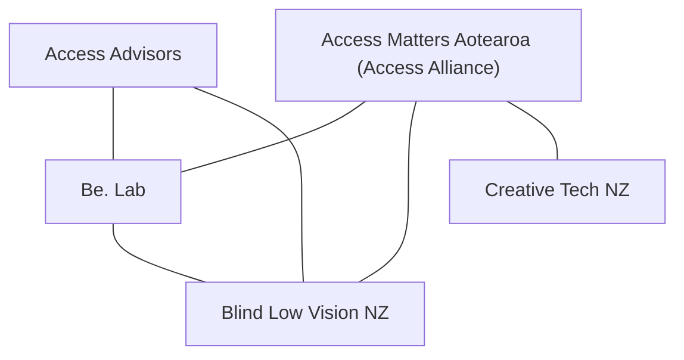

**Human Rights Tech**

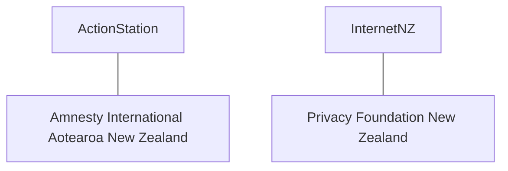

**Legal Aid & Justice Tech**

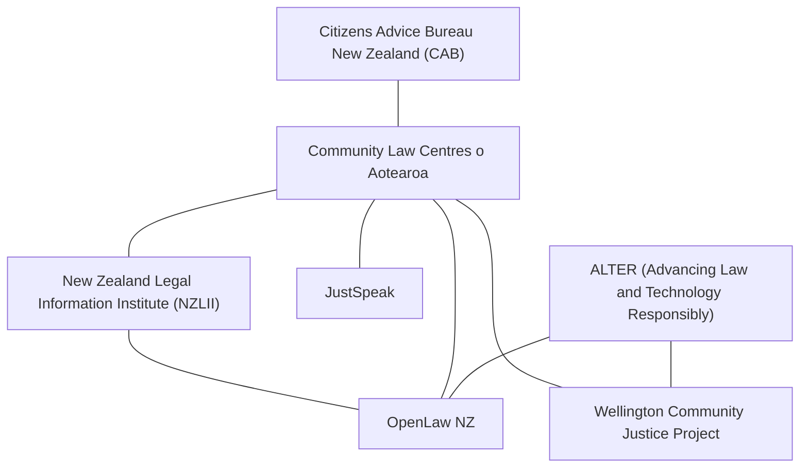

**Iwi & Māori Tech Initiatives**

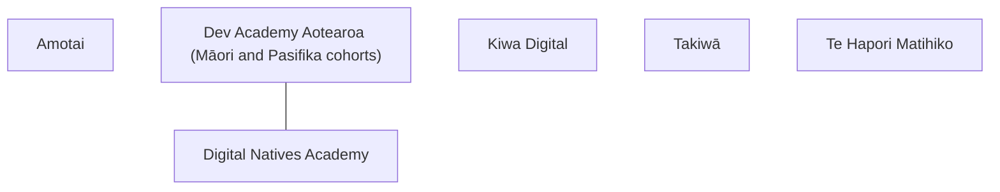

**Food Rescue & Food Security Tech**

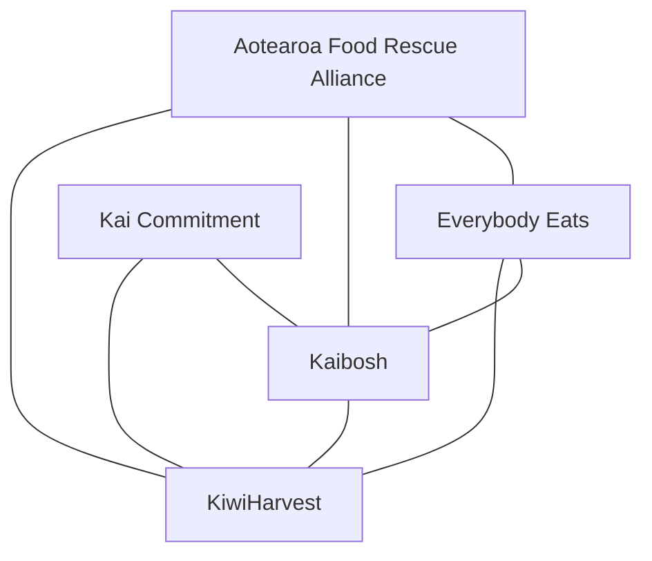

**Refugee & Migrant Support Tech**

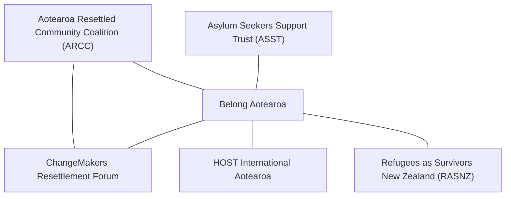

**Green & Climate Tech**

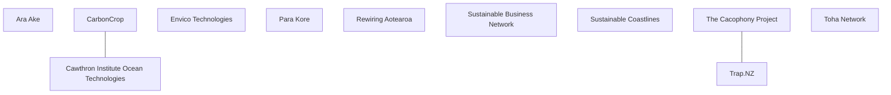

**GovTech**

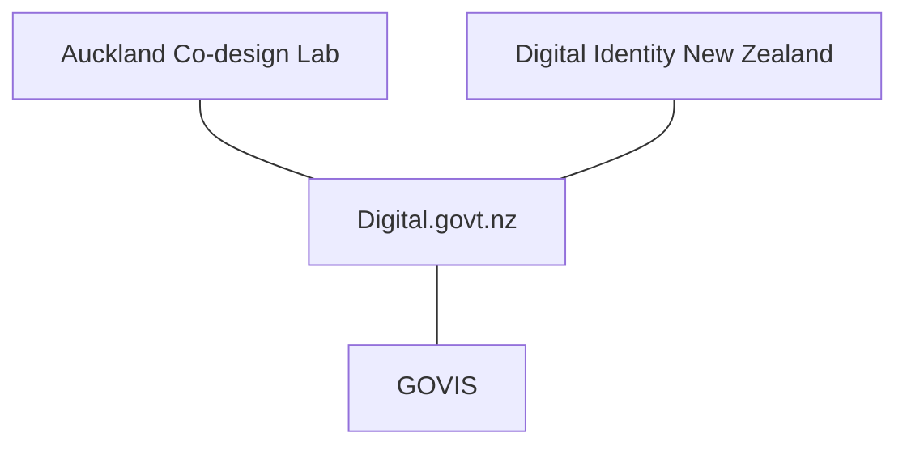

**Open Data**

```mermaid
flowchart TD
    n_AucklandCouncilOpenData["Auckland Council Open Data"]
    n_BayofPlentyRegionalCounc["Bay of Plenty Regional Council Open Data (Bay of Plenty Maps)"]
    n_ChristchurchCityCouncilO["Christchurch City Council Open Data Portal"]
    n_datagovtnz["data.govt.nz"]
    n_DigitalNZ["DigitalNZ"]
    n_DunedinCityCouncilOpenDa["Dunedin City Council Open Data"]
    n_EnvironmentCanterburyOpe["Environment Canterbury Open Data"]
    n_EnvironmentSouthlandOpen["Environment Southland Open Data"]
    n_FigureNZ["Figure.NZ"]
    n_GisborneDistrictCouncilG["Gisborne District Council Geoportal (Tairāwhiti)"]
    n_GreaterWellingtonRegiona["Greater Wellington Regional Council Open Data"]
    n_HawkesBayRegionalCouncil["Hawke's Bay Regional Council Open Data"]
    n_Koordinates["Koordinates"]
    n_LINZDataServiceToitTeWhe["LINZ Data Service (Toitū Te Whenua)"]
    n_ManaakiWhenuaLandcareRes["Manaaki Whenua Landcare Research LRIS Portal"]
    n_MarlboroughDistrictCounc["Marlborough District Council Open Data"]
    n_NelsonCityCouncilOpenDat["Nelson City Council Open Data"]
    n_NIWAEnvironmentalDataSer["NIWA Environmental Data Services"]
    n_NorthlandRegionalCouncil["Northland Regional Council Open Data"]
    n_OtagoRegionalCouncilSpat["Otago Regional Council Spatial Data Portal"]
    n_TaranakiRegionalCouncilO["Taranaki Regional Council Open Data"]
    n_TasmanDistrictCouncilGeo["Tasman District Council GeoHUB"]
    n_WaikatoOpenDataHub["Waikato Open Data Hub"]
    n_WellingtonCityCouncilOpe["Wellington City Council Open Data"]
    n_AucklandCouncilOpenData --- n_Koordinates
    n_AucklandCouncilOpenData --- n_datagovtnz
    n_DigitalNZ --- n_datagovtnz
    n_HawkesBayRegionalCouncil --- n_datagovtnz
    n_Koordinates --- n_LINZDataServiceToitTeWhe
    n_Koordinates --- n_ManaakiWhenuaLandcareRes
    n_Koordinates --- n_datagovtnz
    n_LINZDataServiceToitTeWhe --- n_ManaakiWhenuaLandcareRes
    n_LINZDataServiceToitTeWhe --- n_datagovtnz
    n_OtagoRegionalCouncilSpat --- n_datagovtnz
    n_WaikatoOpenDataHub --- n_datagovtnz
```

**Makerspaces & Hackerspaces**

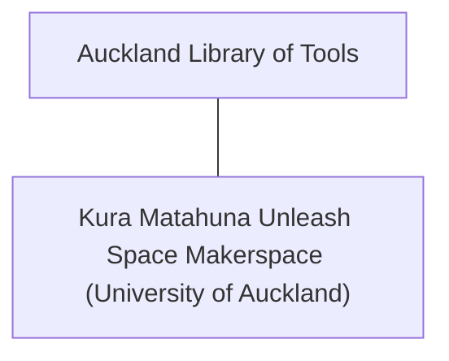

**Environmental Citizen Science**

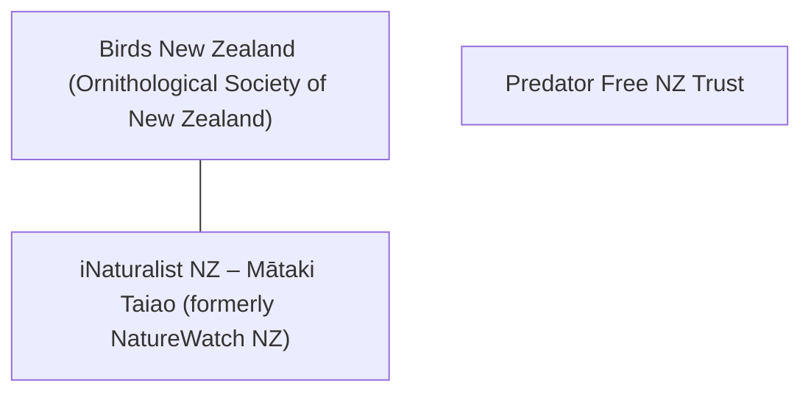

**Worker & Platform Co-ops**

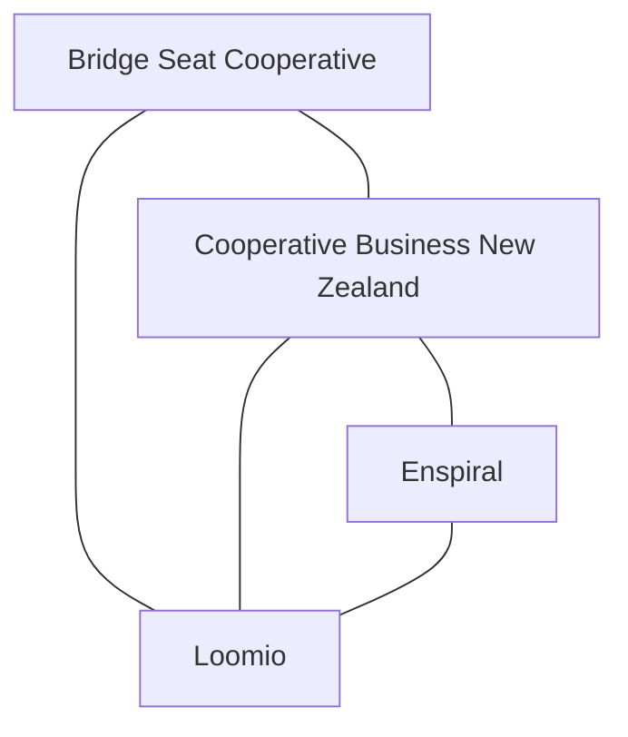

**Mental Health Tech**

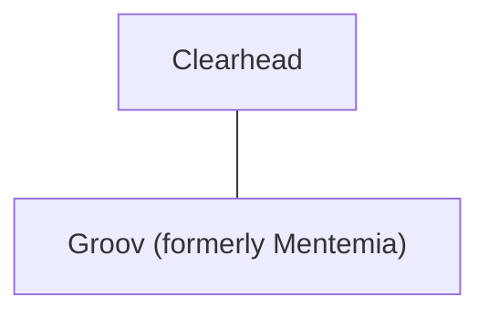

**Nonprofit & NGO Tech**

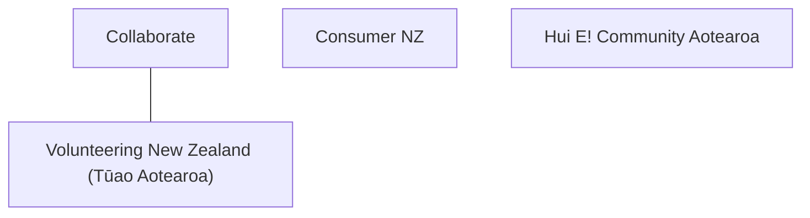

**Digital Inclusion**

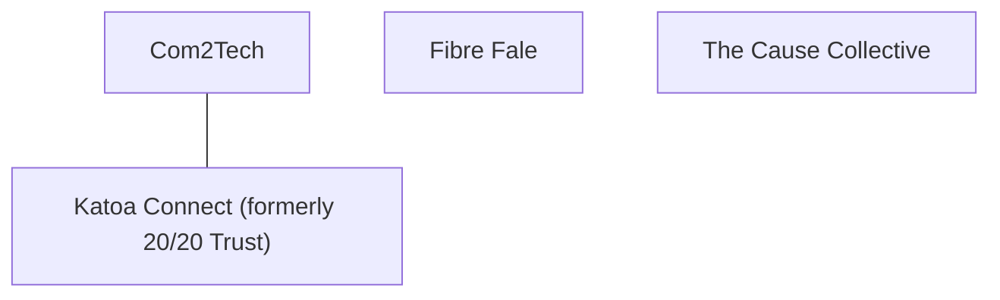

**Crisis & Humanitarian Tech**

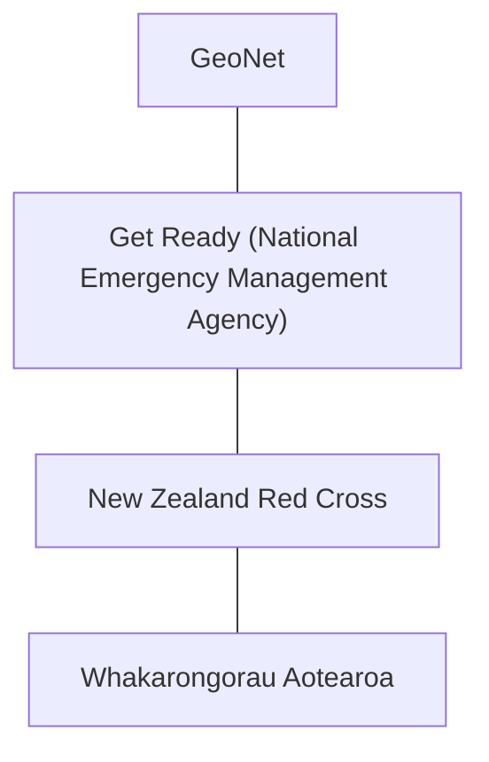

**Financial Inclusion & Fintech for Good**

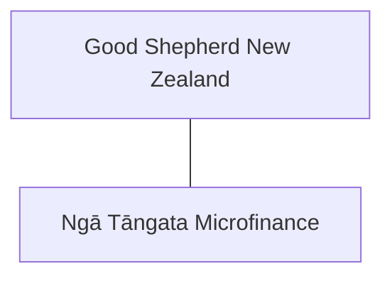

**Civic Tech**

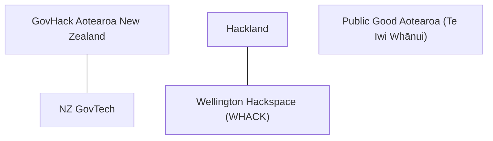

**Disability Employment Tech**

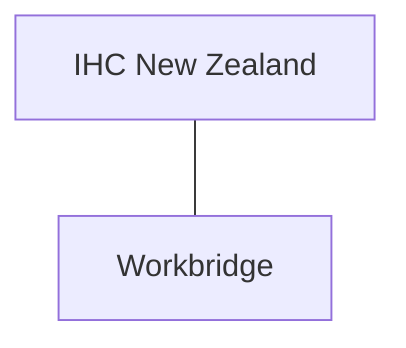

**Journalism & Media Tech**

```mermaid
flowchart TD
    n_Newsroom["Newsroom"]
    n_NZOnAirPublicInterestJou["NZ On Air — Public Interest Journalism Fund"]
    n_TheSpinoff["The Spinoff"]
    n_NZOnAirPublicInterestJou --- n_Newsroom
    n_Newsroom --- n_TheSpinoff
```

**Māori Data Sovereignty**

```mermaid
flowchart TD
    n_NgPaeoteMramatanga["Ngā Pae o te Māramatanga"]
    n_TaiuruAssociates["Taiuru & Associates"]
    n_TeHikuMediaPapaReo["Te Hiku Media / Papa Reo"]
    n_TeHhiriDigitalInnovation["Te Hīhiri Digital Innovation Hub"]
    n_TeKhuiRaraunga["Te Kāhui Raraunga"]
    n_TeManaRaraunga["Te Mana Raraunga"]
    n_NgPaeoteMramatanga --- n_TeKhuiRaraunga
    n_NgPaeoteMramatanga --- n_TeManaRaraunga
    n_TeHikuMediaPapaReo --- n_TeManaRaraunga
    n_TeHhiriDigitalInnovation --- n_TeKhuiRaraunga
    n_TeHhiriDigitalInnovation --- n_TeManaRaraunga
    n_TeKhuiRaraunga --- n_TeManaRaraunga
```

## Disability & Accessibility Tech

_5 entries in this domain._

**Access Advisors**

- Access Advisors is a New Zealand digital accessibility consultancy that helps organisations, including government agencies and banks, test and design websites and services so they work for disabled people, using a panel of disabled testers with real assistive technology.
- Region: national
- Links: [Website](https://accessadvisors.nz)
- Tags: accessibility, disability, consulting, WCAG, assistive technology
- Related: Blind Low Vision NZ, Be. Lab

**Access Matters Aotearoa (Access Alliance)**

- Access Matters Aotearoa (originally the Access Alliance, formed in 2017 with support from Blind Low Vision NZ) is a coalition of disabled people's organisations campaigning for an Accessibility Act that would require services and technology across New Zealand to be accessible to disabled people.
- Region: national
- Links: [Website](https://www.accessmatters.org.nz)
- Tags: accessibility, disability advocacy, legislation, coalition
- Related: Blind Low Vision NZ

**Be. Lab**

- Be. Lab (formerly Be. Accessible) is a New Zealand organisation, launched in 2011, that helps businesses make their websites, apps, and workplaces accessible through digital accessibility assessments, training, and consulting.
- Region: national
- Links: [Website](https://www.belab.co.nz) · [LinkedIn](https://nz.linkedin.com/company/belabnz)
- Tags: accessibility, digital accessibility, consulting, disability employment
- Related: Blind Low Vision NZ, Access Matters Aotearoa

**Blind Low Vision NZ**

- Blind Low Vision NZ (formerly the Royal New Zealand Foundation of the Blind) supports blind, deafblind, and low-vision New Zealanders, including publishing web accessibility guidelines and running an Accessible Formats Service that produces documents in Braille, large print, and audio.
- Region: national
- Links: [Website](https://blindlowvision.org.nz) · [LinkedIn](https://nz.linkedin.com/company/blind-low-vision-nz)
- Tags: accessibility, disability, WCAG, assistive technology, charity
- Related: Access Matters Aotearoa

**Creative Tech NZ**

- Creative Tech NZ, started by disability advocate Glen McMillan, shares stories and resources about how creative and assistive technology, including AI and accessible design, can help disabled children and their families learn, communicate, and take part in everyday life.
- Region: national
- Links: [Website](https://creativetechnewzealand.co.nz)
- Tags: accessibility, assistive technology, disability, children, AI
- Related: Access Matters Aotearoa (Access Alliance)

## Human Rights Tech

_4 entries in this domain._

**ActionStation**

- ActionStation is a New Zealand digital campaigning organisation that helps everyday people run online petitions and coordinated campaigns on issues like Te Tiriti o Waitangi (the Treaty of Waitangi), climate justice, and welfare.
- Region: Wellington
- Links: [Website](https://actionstation.org.nz) · [LinkedIn](https://nz.linkedin.com/company/actionstation)
- Tags: digital campaigning, advocacy, petitions, Te Tiriti

**Amnesty International Aotearoa New Zealand**

- Amnesty International Aotearoa New Zealand is the local chapter of the global human rights movement, established in 1965, that runs online petitions, letter-writing actions, and digital campaigns on issues like refugee rights and climate justice.
- Region: Auckland
- Links: [Website](https://amnesty.org.nz)
- Tags: human rights, digital campaigning, advocacy, non-profit
- Related: ActionStation

**InternetNZ**

- InternetNZ is a non-profit membership organisation that manages the .nz internet domain name system and advocates for an open, secure internet in New Zealand, including work on digital equity and online harm.
- Region: Wellington
- Links: [Website](https://internetnz.nz)
- Tags: digital rights, internet policy, domain names, non-profit

**Privacy Foundation New Zealand**

- The Privacy Foundation is a volunteer-run, not-for-profit society that researches and campaigns for New Zealanders' privacy rights, including a digital economy working group that comments on how technology and data laws affect personal privacy.
- Region: national
- Links: [Website](https://privacyfoundation.nz) · [LinkedIn](https://nz.linkedin.com/company/privacy-foundation-new-zealand)
- Tags: digital rights, privacy, advocacy, non-profit
- Related: InternetNZ

## Tech Ethics & Responsible AI

_1 entry in this domain._

**AI Forum New Zealand**

- AI Forum New Zealand is a member organisation that brings together businesses, researchers, and government to guide artificial intelligence in New Zealand, running working groups on AI governance and a Māori AI Advisory Panel to help make sure AI is developed responsibly and inclusively.
- Region: national
- Links: [Website](https://aiforum.org.nz)
- Tags: responsible AI, tech ethics, industry network, AI governance
- Related: Te Mana Raraunga

## Legal Aid & Justice Tech

_7 entries in this domain._

**ALTER (Advancing Law and Technology Responsibly)**

- ALTER is a University of Auckland Law School initiative that runs a student hackathon, fellowships, and publications to build technology that improves access to legal and social support in New Zealand, while thinking carefully about the ethics of that technology.
- Region: Auckland
- Links: [Website](https://www.alter.auckland.ac.nz/)
- Tags: legal tech, hackathon, university, access to justice, responsible tech
- Related: OpenLaw NZ, Wellington Community Justice Project

**Citizens Advice Bureau New Zealand (CAB)**

- Citizens Advice Bureau New Zealand is a national charity, running since 1970, with about 80 branches and over 2,000 volunteers who give free, confidential advice on legal, tenancy, and everyday problems, and maintain a directory of more than 30,000 community organisations.
- Region: national
- Links: [Website](https://www.cab.org.nz/)
- Tags: legal aid, advice service, non-profit, community directory
- Related: Community Law Centres o Aotearoa

**Community Law Centres o Aotearoa**

- Community Law Centres o Aotearoa runs 24 free legal help centres across New Zealand and publishes the Community Law Manual Online, a free plain-English guide to New Zealand law used by about 70,000 people a month, so people who cannot afford a lawyer can still understand their rights.
- Region: national
- Links: [Website](https://communitylaw.org.nz)
- Tags: legal aid, access to justice, non-profit, legal information

**JustSpeak**

- JustSpeak is a New Zealand movement of young people who campaign for a fairer criminal justice system, pushing for policy based on evidence rather than punishment through public campaigns and submissions to Parliament.
- Region: national
- Links: [Website](https://www.justspeak.org.nz/)
- Tags: justice reform, advocacy, youth movement, non-profit
- Related: Community Law Centres o Aotearoa

**New Zealand Legal Information Institute (NZLII)**

- The New Zealand Legal Information Institute is a free website, run by the law faculties of Otago, Canterbury, and Victoria University of Wellington, that gives anyone free access to New Zealand court decisions, legislation, and law journals that would otherwise cost money to search.
- Region: national
- Links: [Website](https://www.nzlii.org/)
- Tags: legal information, open access, case law, university
- Related: OpenLaw NZ, Community Law Centres o Aotearoa

**OpenLaw NZ**

- OpenLaw NZ is a non-profit charity, started in 2018, that builds free and open-source legal research tools because New Zealand had no free way to search its own laws and court cases online.
- Region: national
- Links: [Website](https://www.openlaw.nz/our-mission)
- Tags: legal tech, open source, access to justice, non-profit
- Related: Community Law Centres o Aotearoa

**Wellington Community Justice Project**

- The Wellington Community Justice Project is a charity run by Victoria University of Wellington law students, started in 2010, that runs free advocacy, education, human rights, and law reform projects to improve access to justice for people the legal system overlooks.
- Region: Wellington
- Links: [Website](https://www.wellingtoncjp.com/)
- Tags: access to justice, student-led, advocacy, non-profit
- Related: Community Law Centres o Aotearoa

## Iwi & Māori Tech Initiatives

_6 entries in this domain._

**Amotai**

- Amotai is Aotearoa's supplier diversity intermediary, connecting public and private sector buyers with over 2,200 verified Māori and Pasifika-owned businesses, including more than 100 tech suppliers working across AI, cybersecurity, automation, and digital services. Founded in 2018 within Auckland Council, it now operates nationally, helping grow Māori and Pasifika business capability and increasing the share of procurement contracts awarded to these communities.
- Region: national
- Links: [Website](https://amotai.nz) · [LinkedIn](https://nz.linkedin.com/company/amotai)
- Tags: māori-business, pasifika-business, supplier-diversity, procurement, economic-equity

**Dev Academy Aotearoa (Māori and Pasifika cohorts)**

- Dev Academy Aotearoa is a New Zealand coding bootcamp that runs dedicated scholarships for Māori, Pasifika, and women, cutting course fees so more people from these groups can retrain as web developers, and it has graduated more than twice the share of women and Māori compared with a typical computer science degree.
- Region: national
- Links: [Website](https://devacademy.co.nz/)
- Tags: Māori tech, coding bootcamp, scholarships, digital skills
- Related: Digital Natives Academy

**Digital Natives Academy**

- Digital Natives Academy is a Rotorua-based charity, started in 2014, that gives young people, especially Māori rangatahi (youth), free training and access to technology in coding, robotics, animation, and game development, to help them move from using technology to creating it.
- Region: Rotorua
- Links: [Website](https://digitalnatives.academy/)
- Tags: Māori tech, youth technology education, digital skills, charity
- Related: Dev Academy Aotearoa

**Kiwa Digital**

- Kiwa Digital is an Auckland technology company, founded in 2003, that builds apps and cloud software helping Indigenous communities record, protect, and share their languages and cultural stories, including tools for te reo Māori.
- Region: Auckland
- Links: [Website](https://kiwadigital.com/)
- Tags: Māori tech, indigenous language technology, cultural data sovereignty, startup
- Related: Te Hiku Media / Papa Reo

**Takiwā**

- Takiwā is a New Zealand geospatial mapping platform, running since 2012, that lets Māori landowners, iwi, and other indigenous communities collect and control their own cultural and environmental data on interactive maps, instead of only government agencies holding that data.
- Region: national
- Links: [Website](https://www.takiwa.co/)
- Tags: Māori tech, indigenous data sovereignty, geospatial, mapping, startup
- Related: Te Kāhui Raraunga, Te Mana Raraunga

**Te Hapori Matihiko**

- Te Hapori Matihiko is a global community for Māori working in, or aspiring to work in, the digital and tech industries. Founded in 2022 by Katie Brown and Lee Timutimu with MBIE Māori Innovation funding, it provides advocacy, professional networking, and cultural support, and runs the annual Ngā Tohu Matihiko awards celebrating Māori excellence in digital and technology across Aotearoa and the world.
- Region: national
- Links: [Website](https://matihiko.nz) · [LinkedIn](https://www.linkedin.com/company/te-hapori-matihiko)
- Tags: māori-tech, digital-community, advocacy, tech-leadership, te-ao-māori

## Food Rescue & Food Security Tech

_5 entries in this domain._

**Aotearoa Food Rescue Alliance**

- The Aotearoa Food Rescue Alliance (AFRA) is the national peak body for food rescue organisations in New Zealand, providing sector coordination, shared data collection through a sector data portal, and advocacy to government on food security policy.
- Region: national
- Links: [Website](https://afra.org.nz) · [LinkedIn](https://nz.linkedin.com/company/aotearoa-food-rescue-alliance)
- Tags: food rescue, food security, advocacy, data, national
- Related: KiwiHarvest, Kaibosh, Everybody Eats

**Everybody Eats**

- Everybody Eats is a New Zealand charity that runs pay-what-you-can restaurants cooking three-course meals from surplus and rescued food, so anyone can eat a proper meal regardless of what they can afford to pay.
- Region: national
- Links: [Website](https://everybodyeats.nz)
- Tags: food rescue, food security, charity, hospitality
- Related: KiwiHarvest, Kaibosh

**Kai Commitment**

- Kai Commitment is a registered New Zealand charity running a food-waste measurement programme for large food businesses, using a Target-Measure-Act-Collaborate data framework to help signatories set reduction targets and track progress toward halving food waste by 2030.
- Region: national
- Links: [Website](https://kaicommitment.org.nz)
- Tags: food waste, data measurement, sustainability, sdg 12.3, charity
- Related: KiwiHarvest, Kaibosh

**Kaibosh**

- Kaibosh is a food rescue charity that has worked in the Wellington region since 2008, using volunteers to collect surplus food from shops and farms and pass it on to community groups, aiming for zero food poverty and zero food waste.
- Region: Wellington
- Links: [Website](https://kaibosh.org.nz)
- Tags: food rescue, food security, charity, volunteer-run
- Related: KiwiHarvest, Everybody Eats

**KiwiHarvest**

- KiwiHarvest is a New Zealand charity, founded in 2012 by Deborah Manning, that collects surplus food from supermarkets, growers, and other businesses before it goes to waste, and gives it to charities feeding people in need.
- Region: national
- Links: [Website](https://www.kiwiharvest.org.nz) · [LinkedIn](https://www.linkedin.com/company/kiwiharvest)
- Tags: food rescue, food security, charity, sustainability
- Related: Kaibosh, Everybody Eats

## Refugee & Migrant Support Tech

_6 entries in this domain._

**Aotearoa Resettled Community Coalition (ARCC)**

- The Aotearoa Resettled Community Coalition is an Auckland umbrella charity representing 26 member organisations from former refugee communities, helping people find housing, healthcare, and legal services, and giving them a collective voice on resettlement issues.
- Region: Auckland
- Links: [Website](https://arcc.org.nz/)
- Tags: refugee support, resettlement, umbrella organisation, non-profit
- Related: Belong Aotearoa, ChangeMakers Resettlement Forum

**Asylum Seekers Support Trust (ASST)**

- The Asylum Seekers Support Trust is the only New Zealand organisation that focuses specifically on people seeking asylum, giving them emergency housing and practical help from qualified social workers while their claims are processed.
- Region: Auckland
- Links: [Website](https://asst.org.nz/)
- Tags: refugee support, asylum seekers, emergency housing, non-profit
- Related: Belong Aotearoa

**Belong Aotearoa**

- Belong Aotearoa (formerly Auckland Regional Migrant Services) is a charity that has helped migrants, international students, and former refugees settle into New Zealand life for over 20 years, running programmes that help people find connection, housing, and work.
- Region: Auckland
- Links: [Website](https://www.belong.org.nz/)
- Tags: refugee support, migrant support, settlement services, non-profit
- Related: HOST International Aotearoa

**ChangeMakers Resettlement Forum**

- ChangeMakers Resettlement Forum is a Wellington-region charity representing more than 18 refugee-background communities, working through advocacy, research, and community projects so former refugees can fully take part in life in New Zealand.
- Region: Wellington
- Links: [Website](https://crf.org.nz/) · [LinkedIn](https://nz.linkedin.com/company/changemakers-resettlement-forum)
- Tags: refugee support, resettlement, advocacy, non-profit
- Related: Belong Aotearoa

**HOST International Aotearoa**

- HOST International Aotearoa is a New Zealand charity that works with former refugees, migrants, and asylum seekers, focusing on new ideas that help people settle in and feel included in their new communities.
- Region: national
- Links: [Website](https://www.hostinternational.org.nz/)
- Tags: refugee support, migrant support, settlement services, non-profit, innovation

**Refugees as Survivors New Zealand (RASNZ)**

- Refugees as Survivors New Zealand is a charity, running since 1995, that gives mental health and wellbeing support to people from refugee backgrounds, including survivors of torture, through specialist assessment and treatment services.
- Region: Auckland
- Links: [Website](https://rasnz.co.nz/)
- Tags: refugee support, mental health, trauma support, non-profit
- Related: Belong Aotearoa

## Green & Climate Tech

_11 entries in this domain._

**Ara Ake**

- Ara Ake is a New Zealand government-established energy innovation centre, based in Taranaki, that helps businesses test and commercialise new clean energy technologies.
- Region: Taranaki
- Links: [Website](https://www.araake.co.nz) · [LinkedIn](https://nz.linkedin.com/company/ara-ake)
- Tags: clean energy, climate tech, government agency, innovation

**CarbonCrop**

- CarbonCrop is a New Zealand company, spun out of the Nelson AI Institute in 2020, that uses artificial intelligence and satellite imagery to help farmers and landowners measure their native forests and turn forest restoration into paid carbon credits.
- Region: Nelson
- Links: [Website](https://www.carboncrop.com) · [LinkedIn](https://nz.linkedin.com/company/carboncrop)
- Tags: climate tech, carbon credits, AI, forestry, startup

**Cawthron Institute Ocean Technologies**

- Cawthron Institute, a science research institute based in Nelson, builds ocean sensors and data buoys that let mussel and salmon farmers check water conditions on their phones, and it recently spun out a company called Ocean Intelligence to sell this technology.
- Region: Nelson
- Links: [Website](https://www.cawthron.org.nz/what-we-do/ocean-health/ocean-technologies/)
- Tags: ocean tech, aquaculture, remote sensors, research institute, climate tech
- Related: CarbonCrop

**Envico Technologies**

- Envico Technologies is a Tauranga-based company that builds heavy-lifting drones to help protect New Zealand's native wildlife, using them to drop pest bait and native seeds in places that are too remote or dangerous for people to reach on foot.
- Region: Tauranga
- Links: [Website](https://www.envicotech.co.nz) · [LinkedIn](https://nz.linkedin.com/company/envicotech)
- Tags: climate tech, conservation tech, drones, pest control, startup

**Para Kore**

- Para Kore is a Māori charitable trust that helps marae, kura, and communities cut waste to zero, teaching zero-waste practices grounded in Māori knowledge and values.
- Region: Waikato
- Links: [Website](https://parakore.maori.nz)
- Tags: zero waste, Māori-led, kaupapa Māori, charitable trust

**Rewiring Aotearoa**

- Rewiring Aotearoa is a New Zealand non-profit that researches and campaigns for households and small businesses to switch from fossil-fuel machines, like petrol cars and gas heaters, to electric ones powered by renewable energy, so people save money and cut carbon emissions.
- Region: national
- Links: [Website](https://www.rewiring.nz) · [LinkedIn](https://www.linkedin.com/company/rewiring-aotearoa)
- Tags: climate tech, energy transition, electrification, advocacy, non-profit

**Sustainable Business Network**

- The Sustainable Business Network is New Zealand's longest-running sustainable business organisation, helping companies act on climate change, waste, and nature through training, tools, and research reports on clean-tech innovation.
- Region: Auckland
- Links: [Website](https://sustainable.org.nz) · [LinkedIn](https://nz.linkedin.com/company/sustainable-business-network)
- Tags: sustainability, climate action, business network, clean tech

**Sustainable Coastlines**

- Sustainable Coastlines is an Auckland-based charity that runs Litter Intelligence, New Zealand's national database of beach litter, where trained volunteers survey rubbish on beaches using a standard method so the data can be used by government to shape plastic pollution policy.
- Region: Auckland
- Links: [Website](https://sustainablecoastlines.org) · [LinkedIn](https://nz.linkedin.com/company/sustainable-coastlines)
- Tags: climate tech, environmental data, citizen science, charity, plastic pollution

**The Cacophony Project**

- The Cacophony Project is a New Zealand non-profit that builds free, open-source cameras and software that use artificial intelligence to automatically spot introduced predators, like rats and stoats, so conservation workers can protect native birds more effectively.
- Region: national
- Links: [Website](https://www.cacophony.org.nz) · [GitHub](https://github.com/TheCacophonyProject)
- Tags: climate tech, conservation tech, AI, open source, non-profit, predator control

**Toha Network**

- Toha is a New Zealand technology platform that lets landowners and community groups get paid for verified environmental work, like restoring wetlands or improving water quality, by turning that work into tradeable, data-backed environmental credits.
- Region: national
- Links: [Website](https://toha.network) · [LinkedIn](https://nz.linkedin.com/company/toha-nz)
- Tags: climate tech, environmental data, regenerative economy, fintech

**Trap.NZ**

- Trap.NZ is a free app built by New Zealand company Groundtruth, with support from WWF-New Zealand, that lets community volunteers record and map where they trap pest animals like rats and possums, so more than 9,000 conservation groups can see where pests are being caught across the country.
- Region: national
- Links: [Website](https://trap.nz)
- Tags: predator control, conservation, community science, Predator Free 2050, mapping
- Related: The Cacophony Project

## GovTech

_4 entries in this domain._

**Auckland Co-design Lab**

- The Auckland Co-design Lab is a public sector innovation team, jointly funded by Auckland Council and several central government agencies, that works directly with communities and iwi (Māori tribal groups) to design better public services for complex social problems.
- Region: Auckland
- Links: [Website](https://www.aucklandco-lab.nz) · [LinkedIn](https://nz.linkedin.com/company/auckland-co-design-lab)
- Tags: govtech, service design, public sector innovation, co-design
- Related: Digital.govt.nz

**Digital Identity New Zealand**

- Digital Identity New Zealand brings together government, business, and community groups working on digital identity, so that New Zealanders can prove who they are online in ways that are open, trustworthy, and work well together.
- Region: national
- Links: [Website](https://digitalidentity.nz)
- Tags: digital identity, digital trust, industry association, govtech
- Related: Digital.govt.nz

**Digital.govt.nz**

- Digital.govt.nz is the New Zealand government's hub for digital transformation guidance, standards, and case studies, including work formerly run by the Department of Internal Affairs' Service Innovation Lab (which closed after several years of running government innovation projects).
- Region: national
- Links: [Website](https://www.digital.govt.nz)
- Tags: govtech, digital government, standards, service design
- Related: Auckland Co-Design Lab, data.govt.nz

**GOVIS**

- GOVIS is a non-profit association of New Zealand government IT and information professionals, running since 1991, that organises conferences and forums to help public servants share knowledge about technology, data, and digital government.
- Region: Wellington
- Links: [Website](https://www.govis.org.nz) · [LinkedIn](https://nz.linkedin.com/company/govis-incorporated)
- Tags: govtech, government IT, professional community, non-profit
- Related: Digital.govt.nz, NZ GovTech

## Open Data

_24 entries in this domain._

**Auckland Council Open Data**

- Auckland Council Open Data is the council's public website for browsing and downloading geospatial datasets, such as maps of parks, property boundaries, and infrastructure, so residents and developers can reuse council information.
- Region: Auckland
- Links: [Website](https://data-aucklandcouncil.opendata.arcgis.com/)
- Tags: open data, geospatial, local government, council
- Related: data.govt.nz, Koordinates

**Bay of Plenty Regional Council Open Data (Bay of Plenty Maps)**

- Bay of Plenty Maps is an open data site where Bay of Plenty Regional Council, Tauranga City Council, Western Bay of Plenty District Council, and Whakatāne District Council share public spatial data, like resource consents and council boundaries.
- Region: Bay of Plenty
- Links: [Website](https://data-boprc.opendata.arcgis.com/)
- Tags: regional council, open data, environment, GIS

**Christchurch City Council Open Data Portal**

- Christchurch City Council's Spatial Open Data Portal publishes public datasets about council assets, infrastructure, and planning rules, so contractors and residents can find authoritative maps of the city.
- Region: Christchurch
- Links: [Website](https://opendata-christchurchcity.hub.arcgis.com/)
- Tags: city council, open data, GIS

**data.govt.nz**

- data.govt.nz is the New Zealand government's central website for finding and downloading open datasets published by government agencies, covering topics like health, education, transport, and the environment.
- Region: national
- Links: [Website](https://data.govt.nz)
- Tags: open data, government, data catalogue, govtech
- Related: LINZ Data Service, DigitalNZ, GovHack Aotearoa

**DigitalNZ**

- DigitalNZ, run by the National Library of New Zealand, is a search service and open application programming interface (API) that brings together more than 30 million digitised items (photos, articles, and records) from over 200 New Zealand museums, libraries, and archives into one searchable place.
- Region: national
- Links: [Website](https://digitalnz.org) · [GitHub](https://github.com/DigitalNZ)
- Tags: open data, cultural heritage, API, aggregator, open source
- Related: data.govt.nz, GovHack Aotearoa

**Dunedin City Council Open Data**

- Dunedin City Council runs an open data hub where people can explore and download the council's public spatial data and build their own maps and tools with it.
- Region: Dunedin
- Links: [Website](https://city-of-dunedin-open-data-dunedin-gis.hub.arcgis.com/)
- Tags: city council, open data, GIS

**Environment Canterbury Open Data**

- Environment Canterbury runs an open data portal where anyone can download the regional council's public information about air quality, freshwater, and resource consents in the Canterbury region.
- Region: Canterbury
- Links: [Website](https://data.ecan.govt.nz/)
- Tags: regional council, open data, environment, GIS

**Environment Southland Open Data**

- Environment Southland, the Southland Regional Council, publishes open GIS data on rivers, resource consents, and monitoring sites, including live environmental data like river flows and rainfall for the Southland region.
- Region: Southland
- Links: [Website](https://data-esgis.opendata.arcgis.com/)
- Tags: regional council, open data, environment, GIS

**Figure.NZ**

- Figure.NZ is a charity that publishes free, easy-to-understand data and charts about New Zealand, so anyone can find and reuse the country's numbers without needing to be a data expert.
- Region: Auckland
- Links: [Website](https://figure.nz) · [LinkedIn](https://nz.linkedin.com/company/figure-nz)
- Tags: open data, data visualisation, data literacy, charity

**Gisborne District Council Geoportal (Tairāwhiti)**

- Gisborne District Council's Geoportal Data Hub lets people explore and download public spatial data for the Tairāwhiti (Gisborne) region, like parks, public toilets, and sites of geological significance.
- Region: Gisborne
- Links: [Website](https://geoportal-gizzy.opendata.arcgis.com/)
- Tags: district council, open data, GIS

**Greater Wellington Regional Council Open Data**

- Greater Wellington Regional Council shares open data on air quality, rainfall, river levels, and water quality for the Wellington region, free to download or connect to as live map layers.
- Region: Wellington
- Links: [Website](https://data-gwrc.opendata.arcgis.com/)
- Tags: regional council, open data, environment, GIS

**Hawke's Bay Regional Council Open Data**

- Hawke's Bay Regional Council's open data page lets people view and download council-collected data, like water quality and environmental monitoring information, for free reuse.
- Region: Hawke's Bay
- Links: [Website](https://www.hbrc.govt.nz/our-council/open-data/)
- Tags: open data, environmental data, local government, council
- Related: data.govt.nz

**Koordinates**

- Koordinates is an Auckland-founded company that runs a cloud platform for storing, versioning, and sharing geospatial data, and it is the technology behind the government's LINZ Data Service.
- Region: Auckland
- Links: [Website](https://koordinates.com) · [GitHub](https://github.com/koordinates) · [LinkedIn](https://nz.linkedin.com/company/koordinates)
- Tags: open data, geospatial, government contractor, open source
- Related: LINZ Data Service (Toitū Te Whenua), data.govt.nz

**LINZ Data Service (Toitū Te Whenua)**

- The LINZ Data Service, run by Land Information New Zealand (a government agency, known in Māori as Toitū Te Whenua), gives free open access to New Zealand's land, property, and seabed data, including maps, aerial imagery, and elevation data.
- Region: national
- Links: [Website](https://www.linz.govt.nz/products-services/data/linz-data-service) · [GitHub](https://github.com/linz)
- Tags: open data, geospatial, government, mapping, open source
- Related: data.govt.nz, GovHack Aotearoa

**Manaaki Whenua Landcare Research LRIS Portal**

- The Land Resource Information System (LRIS) Portal, run by Crown research institute Manaaki Whenua Landcare Research, is a free online tool with over 200 layers of New Zealand land data, like soil types, erosion risk, and land cover, that anyone can search and download.
- Region: national
- Links: [Website](https://soils.landcareresearch.co.nz/tools/lris-portal)
- Tags: land data, soil data, conservation, Crown research institute, open data
- Related: LINZ Data Service (Toitū Te Whenua), Koordinates

**Marlborough District Council Open Data**

- Marlborough District Council shares its public geographic data, such as property boundaries and environmental information, through an open data portal that anyone can browse and download from.
- Region: Marlborough
- Links: [Website](https://data-marlborough.opendata.arcgis.com/)
- Tags: district council, open data, GIS

**Nelson City Council Open Data**

- Nelson City Council publishes its public GIS data, such as property and infrastructure information, through an ArcGIS open data portal that anyone can browse for free.
- Region: Nelson
- Links: [Website](https://data2018-12-16t234104082z-nelsoncity.opendata.arcgis.com/)
- Tags: city council, open data, GIS

**NIWA Environmental Data Services**

- NIWA, now part of Earth Sciences New Zealand after a 2025 merger with GNS Science, runs online tools like the Hydro Web Portal and National Climate Database, which let people look up New Zealand's river flow, rainfall, and climate data for free.
- Region: national
- Links: [Website](https://niwa.co.nz/environmental-information/environmental-information-services-0)
- Tags: climate data, water data, open data, science institute
- Related: GeoNet

**Northland Regional Council Open Data**

- Northland Regional Council publishes an open data portal with public information, such as resource consents and land use data, for people who want to make their own maps of the Northland region.
- Region: Northland
- Links: [Website](https://data-nrcgis.opendata.arcgis.com/)
- Tags: regional council, open data, environment, GIS

**Otago Regional Council Spatial Data Portal**

- The Otago Regional Council Spatial Data Portal is a website where people can discover, explore, and download the council's geographic datasets, like maps of land, water, and boundaries in the Otago region.
- Region: Otago
- Links: [Website](https://orc-spatial-data-portal-orcnz.hub.arcgis.com/)
- Tags: open data, geospatial, local government, council
- Related: data.govt.nz

**Taranaki Regional Council Open Data**

- Taranaki Regional Council's open data hub lets people download public datasets and story maps about biodiversity, rivers, resource consents, and iwi boundaries in the Taranaki region.
- Region: Taranaki
- Links: [Website](https://opendata-trcnz.hub.arcgis.com/)
- Tags: regional council, open data, environment, GIS

**Tasman District Council GeoHUB**

- Tasman District Council's GeoHUB is an open data catalogue where people can download the council's public GIS layers, like property and planning information, for the Tasman region.
- Region: Tasman
- Links: [Website](https://geohub.tasman.govt.nz/)
- Tags: district council, open data, GIS

**Waikato Open Data Hub**

- The Waikato Open Data Hub is a website where nine councils across the Waikato region share their maps and datasets together, covering things like roads, pipes, and land boundaries, so anyone can search and download them in one place.
- Region: Waikato
- Links: [Website](https://colabsolutions.govt.nz/shared-services/geospatial-projects-and-services/wodh/)
- Tags: open data, geospatial, local government, council
- Related: data.govt.nz

**Wellington City Council Open Data**

- Wellington City Council has published open geospatial data since 2010, including aerial photos, historic maps, building footprints, and hazard information, free for anyone to download and reuse.
- Region: Wellington
- Links: [Website](https://data-wcc.opendata.arcgis.com/)
- Tags: city council, open data, GIS

## Makerspaces & Hackerspaces

_2 entries in this domain._

**Auckland Library of Tools**

- Auckland Library of Tools is a Grey Lynn community hub where people can borrow up to 10 tools at a time, from power drills to sewing machines, instead of buying their own, and it also runs monthly repair cafes to help people fix things rather than throw them away.
- Region: Auckland
- Links: [Website](https://www.aucklandlibraryoftools.com/)
- Tags: makerspace, tool library, community tech space, sustainability, volunteer-run
- Related: Hackland

**Kura Matahuna Unleash Space Makerspace (University of Auckland)**

- Kura Matahuna Unleash Space Makerspace is a free workshop at the University of Auckland, open to all students and staff, with 3D printers, laser cutters, and electronics gear, where people learn to build and prototype their own projects after safety training.
- Region: Auckland
- Links: [Website](https://www.auckland.ac.nz/en/cie/locations/unleash-space/makerspace.html)
- Tags: makerspace, university, digital fabrication, prototyping, innovation hub
- Related: Hackland, Auckland Library of Tools

## Environmental Citizen Science

_3 entries in this domain._

**Birds New Zealand (Ornithological Society of New Zealand)**

- Birds New Zealand is the country's bird-watching and research society, running citizen science projects and pointing members to tools like eBird so anyone can record bird sightings and help build a picture of how New Zealand's bird populations are changing.
- Region: national
- Links: [Website](https://www.birdsnz.org.nz)
- Tags: citizen science, birds, conservation, non-profit
- Related: iNaturalist NZ – Mātaki Taiao (formerly NatureWatch NZ)

**iNaturalist NZ – Mātaki Taiao (formerly NatureWatch NZ)**

- iNaturalist NZ – Mātaki Taiao, run by the New Zealand Bio-Recording Network Trust, is a website and app where anyone can record sightings of plants, animals, and fungi, helping scientists track new and spreading species across the country; it started in 2006 as NatureWatch NZ and rebranded in 2018.
- Region: national
- Links: [Website](https://www.inaturalist.nz)
- Tags: citizen science, biodiversity, conservation, open data
- Related: The Cacophony Project, Trap.NZ

**Predator Free NZ Trust**

- Predator Free NZ Trust mobilises communities across the country to trap invasive predators and protect native wildlife, using a national map, trail cameras, and data tools so volunteers can track and coordinate their conservation efforts.
- Region: national
- Links: [Website](https://predatorfreenz.org)
- Tags: conservation, citizen science, predator control, community mapping
- Related: Trap.NZ, The Cacophony Project

## Worker & Platform Co-ops

_4 entries in this domain._

**Bridge Seat Cooperative**

- Bridge Seat Cooperative is a small worker-owned group of freelance technology workers based in New Zealand who host services for the decentralised social web, aiming to keep parts of the internet run as a shared public service rather than for commercial profit.
- Region: national
- Links: [Website](https://bridgeseat.substack.com)
- Tags: worker cooperative, platform cooperative, decentralised web, freelance
- Related: Loomio, Cooperative Business New Zealand

**Cooperative Business New Zealand**

- Cooperative Business New Zealand is the peak industry body for cooperatives, mutuals, and member-owned businesses, representing them to government and running education and networking programmes like the Co-op Academy.
- Region: national
- Links: [Website](https://nz.coop)
- Tags: worker cooperative, peak body, advocacy, member-owned business
- Related: Loomio, Enspiral

**Enspiral**

- Enspiral is a Wellington-founded network of people and social enterprises who support each other to do work that helps society, and it is the community that the decision-making tool Loomio originally grew out of.
- Region: Wellington
- Links: [Website](https://www.enspiral.com) · [LinkedIn](https://nz.linkedin.com/company/enspiral)
- Tags: social enterprise network, cooperative, incubator, collective
- Related: Loomio

**Loomio**

- Loomio is a Wellington-based worker-owned cooperative that builds open-source software helping groups, from community organisations to unions, discuss a topic and reach a collective decision online.
- Region: Wellington
- Links: [Website](https://www.loomio.com) · [GitHub](https://github.com/loomio)
- Tags: worker cooperative, decision-making, open source, civic tech
- Related: Enspiral

## Research & Education Tech

_6 entries in this domain._

**Catalyst IT**

- Catalyst IT is a New Zealand-owned open-source software company, founded in Wellington in 1997, that builds and supports open-source systems for education (such as Moodle) and libraries (such as Koha), and does significant work for the public sector.
- Region: Wellington
- Links: [Website](https://www.catalyst.net.nz) · [LinkedIn](https://nz.linkedin.com/company/catalyst-it-limited)
- Tags: open source, education technology, library systems, government contractor
- Related: Digital.govt.nz

**KiwiNet (Kiwi Innovation Network)**

- KiwiNet is a network of 14 New Zealand universities and research organisations that funds early-stage research and helps scientists turn discoveries into real-world products, patents, and startup companies.
- Region: national
- Links: [Website](https://kiwinet.org.nz) · [LinkedIn](https://nz.linkedin.com/company/kiwinetnz)
- Tags: research commercialisation, university network, innovation funding, startups
- Related: Ara Ake

**Koi Tū – Centre for Informed Futures**

- Koi Tū is an independent research centre at the University of Auckland that studies big, long-term problems facing New Zealand, like technology's impact on society, and turns that research into policy advice.
- Region: Auckland
- Links: [Website](https://informedfutures.org)
- Tags: policy research, future of technology, University of Auckland, think tank

**REANNZ**

- REANNZ (Research and Education Advanced Network New Zealand) is a Crown-owned non-profit that runs New Zealand's high-speed internet network dedicated to universities, research institutes, and schools, connecting them to more than 120 similar networks worldwide.
- Region: national
- Links: [Website](https://www.reannz.co.nz) · [LinkedIn](https://nz.linkedin.com/company/reannz)
- Tags: research network, education infrastructure, Crown entity, connectivity

**Te Pūnaha Matatini**

- Te Pūnaha Matatini is a research centre that studies complex systems, like disease spread, ecosystems, and social networks, to help New Zealand understand and respond to big interconnected challenges.
- Region: Auckland
- Links: [Website](https://www.tepunahamatatini.ac.nz)
- Tags: complex systems research, data science, Centre of Research Excellence, University of Auckland

**Tātai Aho Rau Core Education**

- Tātai Aho Rau Core Education is a Christchurch-founded, charity-registered social enterprise that has worked since 2003 on educational research, teacher professional development, and free digital resources like the LEARNZ virtual field trips for New Zealand schools.
- Region: Christchurch
- Links: [Website](https://core-ed.org) · [LinkedIn](https://nz.linkedin.com/company/tatai-aho-rau-core-education)
- Tags: education technology, research, teacher training, charity

## Mental Health Tech

_2 entries in this domain._

**Clearhead**

- Clearhead is a New Zealand company, built with clinical experts, that gives workplaces a digital mental health platform with self-help tools, staff wellbeing data, and access to therapy sessions in person, online, or after hours.
- Region: national
- Links: [Website](https://www.myclearhead.com)
- Tags: mental health, employee wellbeing, digital health, startup
- Related: Groov (formerly Mentemia)

**Groov (formerly Mentemia)**

- Groov is a New Zealand mental health app, started in 2018 by former All Black Sir John Kirwan and tech entrepreneur Adam Clark under the name Mentemia, that gives people simple daily tools like mindfulness exercises and mood tracking to look after their mental wellbeing.
- Region: national
- Links: [Website](https://www.groovnow.com)
- Tags: mental health, wellbeing app, corporate wellbeing, startup
- Related: Whakarongorau Aotearoa

## Nonprofit & NGO Tech

_4 entries in this domain._

**Collaborate**

- Collaborate is a New Zealand volunteering app that matches people's skills and interests to volunteer roles at non-profit and community organisations, and has been used by groups including New Zealand Red Cross.
- Region: national
- Links: [Website](https://www.letscollaborate.co.nz)
- Tags: volunteering, nonprofit tech, matching platform, app
- Related: New Zealand Red Cross

**Consumer NZ**

- Consumer NZ is an independent, not-for-profit organisation, running since 1959, that tests products, publishes reviews, and campaigns for stronger consumer protection laws so New Zealanders can make better purchasing decisions.
- Region: Auckland
- Links: [Website](https://www.consumer.org.nz) · [LinkedIn](https://nz.linkedin.com/company/consumer-nz)
- Tags: consumer protection, advocacy, product testing, non-profit

**Hui E! Community Aotearoa**

- Hui E! Community Aotearoa connects community groups, hapū, and iwi around the country, helping them build capability and pushing for fairer funding and policy for the community sector.
- Region: Wellington
- Links: [Website](https://www.huie.org.nz)
- Tags: community sector, capability building, Treaty partnership, network

**Volunteering New Zealand (Tūao Aotearoa)**

- Volunteering New Zealand is the national body for volunteering, an incorporated society that runs training, online tools, and a volunteer centre network to help community organisations recruit and manage volunteers.
- Region: Wellington
- Links: [Website](https://www.volunteeringnz.org.nz)
- Tags: volunteering, nonprofit tech, peak body, community organisations
- Related: Collaborate

## Digital Inclusion

_4 entries in this domain._

**Com2Tech**

- Com2Tech is a volunteer-led community trust in Dunedin that provides free digital skills classes, low-cost refurbished devices, and community tech support to help people of all ages get online, including dedicated programmes for seniors and job-seekers.
- Region: Otago
- Links: [Website](https://www.com2.tech) · [LinkedIn](https://nz.linkedin.com/company/community-communications-technology-trust-com2tech)
- Tags: digital inclusion, device recycling, community tech, seniors, dunedin
- Related: Katoa Connect (formerly 20/20 Trust)

**Fibre Fale**

- Fibre Fale is a Pasifika-led social enterprise creating pathways into the technology industry for Pacific people in Aotearoa. Founded in 2022, it delivers events, mentoring programmes, and free AI literacy resources (including the 'AI with Eteroa' online course), with a goal of equal Pasifika representation in the NZ tech workforce by 2042.
- Region: Auckland
- Links: [Website](https://www.fibrefale.com) · [LinkedIn](https://www.linkedin.com/company/fibre-fale)
- Tags: pasifika, digital-inclusion, tech-pathways, ai-literacy, social-enterprise

**Katoa Connect (formerly 20/20 Trust)**

- Katoa Connect, previously known as the 20/20 Trust, is a New Zealand charity that helps adults build everyday digital skills, like online banking and job applications, so the more than 800,000 New Zealand adults who currently lack these skills are not left behind.
- Region: national
- Links: [Website](https://www.katoaconnect.org.nz)
- Tags: digital inclusion, digital skills, charity, adult education

**The Cause Collective**

- The Cause Collective is a South Auckland charitable organisation that runs a Creative and Tech Hub and a mobile tech van, giving rangatahi Maori and Pasifika free hands-on technology training, device access, and pathways into the tech sector.
- Region: Tamaki Makaurau
- Links: [Website](https://www.thecausecollective.org.nz) · [LinkedIn](https://nz.linkedin.com/company/the-cause-collective-nz)
- Tags: digital inclusion, maori, pasifika, youth tech, south auckland

## Housing & Homelessness Tech

_1 entry in this domain._

**Community Housing Aotearoa**

- Community Housing Aotearoa is the peak body for New Zealand's community housing sector, representing more than 175 housing providers and partners who together house around 30,000 people, and it campaigns and shares research so more New Zealanders can access a warm, safe, affordable home.
- Region: Wellington
- Links: [Website](https://www.communityhousing.org.nz)
- Tags: housing, homelessness, peak body, advocacy

## Education Equity Tech

_4 entries in this domain._

**Digital Future Aotearoa**

- Digital Future Aotearoa is a Christchurch-based charitable trust (CC51617) that runs Code Club Aotearoa, a national network of free coding clubs for children, and the Recycle a Device programme, which refurbishes donated laptops for students who cannot afford a device.
- Region: Canterbury
- Links: [Website](https://www.digitalfutureaotearoa.nz) · [LinkedIn](https://nz.linkedin.com/company/digital-future-aotearoa)
- Tags: coding education, digital inclusion, device recycling, youth, christchurch
- Related: Digital Natives Academy

**Manaiakalani Education Trust**

- Manaiakalani Education Trust is an Auckland-based charity that runs a digital learning programme for schools in lower-income communities, giving students devices and teachers training so technology helps close, rather than widen, the education gap for Māori and Pacific students.
- Region: Auckland
- Links: [Website](https://www.manaiakalani.org) · [LinkedIn](https://www.linkedin.com/company/manaiakalani-education-trust)
- Tags: education equity, digital learning, charity, Māori and Pacific education
- Related: Dev Academy Aotearoa (Māori and Pasifika cohorts), Digital Natives Academy

**Pūhoro STEMM Academy**

- Pūhoro STEMM Academy supports Māori secondary school students (rangatahi) into science, technology, engineering, mathematics, and mātauranga (STEMM) pathways. Founded in 2016 at Massey University in Palmerston North, it delivers kaupapa Māori mentoring, tutoring, and wānanga across 12 regions, improving academic achievement and building pathways into high-value STEMM careers for rangatahi who would otherwise be under-represented in these fields.
- Region: national
- Links: [Website](https://www.puhoro.org.nz) · [LinkedIn](https://nz.linkedin.com/company/p%C5%ABhoro)
- Tags: kaupapa-māori, stemm, rangatahi, science-pathways, education

**Summer of Tech**

- Summer of Tech is a New Zealand charitable programme that connects students and junior tech talent with employers through internships and mentoring, helping people get their first step into a tech career.
- Region: national
- Links: [Website](https://www.summeroftech.co.nz)
- Tags: internships, tech careers, talent pipeline, charity
- Related: Dev Academy Aotearoa

## Crisis & Humanitarian Tech

_4 entries in this domain._

**GeoNet**

- GeoNet is New Zealand's natural hazard monitoring system, run by GNS Science with government partners, using over 1,000 sensors to provide free, real-time open data on earthquakes, volcanoes, tsunamis, and landslides.
- Region: national
- Links: [Website](https://www.geonet.org.nz)
- Tags: disaster monitoring, open data, earthquakes, science agency
- Related: data.govt.nz

**Get Ready (National Emergency Management Agency)**

- Get Ready is the New Zealand government's National Emergency Management Agency website that helps people prepare for disasters like earthquakes and floods, including information on the Emergency Mobile Alert system that broadcasts warnings straight to phones without needing an app.
- Region: national
- Links: [Website](https://getready.govt.nz)
- Tags: disaster preparedness, government agency, emergency alerts, civil defence
- Related: GeoNet, New Zealand Red Cross

**New Zealand Red Cross**

- New Zealand Red Cross runs the free Hazard App, downloaded over 200,000 times, which sends official emergency warnings and step-by-step guidance to help people prepare for and get through disasters.
- Region: national
- Links: [Website](https://www.redcross.org.nz)
- Tags: disaster response, emergency app, humanitarian, NGO
- Related: Collaborate

**Whakarongorau Aotearoa**

- Whakarongorau Aotearoa (formerly Homecare Medical) is New Zealand's government-funded telehealth provider, running free 24/7 phone and text services like Healthline and the 1737 Need to Talk mental health line for millions of callers a year.
- Region: national
- Links: [Website](https://whakarongorau.nz) · [LinkedIn](https://nz.linkedin.com/company/whakarongorau-new-zealand)
- Tags: telehealth, crisis line, mental health, government-funded
- Related: New Zealand Red Cross

## Volunteering & Giving Platforms

_1 entry in this domain._

**Givealittle**

- Givealittle is a New Zealand-owned, not-for-profit crowdfunding website, owned by Perpetual Guardian, where people and charities can raise money online for personal causes, community projects, and disaster response.
- Region: Auckland
- Links: [Website](https://www.givealittle.co.nz) · [LinkedIn](https://www.linkedin.com/company/givealittle)
- Tags: crowdfunding, giving platform, charity, fundraising
- Related: Volunteering New Zealand (Tūao Aotearoa)

## Financial Inclusion & Fintech for Good

_2 entries in this domain._

**Good Shepherd New Zealand**

- Good Shepherd New Zealand is a charity that helps women, girls, and families facing hardship, including family violence, by giving no-interest loans, insurance help, and financial counselling so people can avoid predatory lenders and unmanageable debt.
- Region: Wellington
- Links: [Website](https://www.goodshepherd.org.nz) · [LinkedIn](https://www.linkedin.com/company/good-shepherd-nz)
- Tags: financial inclusion, microfinance, charity, family violence support
- Related: Ngā Tāngata Microfinance

**Ngā Tāngata Microfinance**

- Ngā Tāngata Microfinance is a New Zealand non-profit, backed by Kiwibank, that gives interest-free and fee-free loans up to $5,000 to financially vulnerable New Zealanders, after they work with a financial mentor, so people can avoid high-interest debt.
- Region: national
- Links: [Website](https://ngatangatamicrofinance.org.nz)
- Tags: financial inclusion, microfinance, non-profit, fintech
- Related: Good Shepherd New Zealand

## Civic Tech

_5 entries in this domain._

**GovHack Aotearoa New Zealand**

- GovHack is an annual 46-hour hackathon held across Australia and New Zealand where teams build projects using open government data, run in NZ cities including Auckland, Wellington, Christchurch, and Dunedin.
- Region: national
- Links: [Website](https://www.govhack.org) · [LinkedIn](https://nz.linkedin.com/company/govhack)
- Tags: hackathon, open data, civic tech, volunteer-run
- Related: data.govt.nz, DigitalNZ, LINZ Data Service

**Hackland**

- Hackland is a volunteer-run community makerspace in Grey Lynn, Auckland, where members share tools like 3D printers, laser cutters, and woodworking and metalworking equipment, and learn skills from each other at weekly open evenings.
- Region: Auckland
- Links: [Website](https://hackland.nz) · [GitHub](https://github.com/HakLand)
- Tags: makerspace, hackerspace, community tech space, volunteer-run

**NZ GovTech**

- NZ GovTech is a Wellington-based volunteer community group, with nearly 1,000 members, that brings together public servants and technologists to talk about open government, civic innovation, and using technology to solve public problems.
- Region: Wellington
- Links: [Website](https://www.meetup.com/nzgovtech/)
- Tags: civic tech, open government, community group, meetup
- Related: GovHack Aotearoa New Zealand, GOVIS

**Public Good Aotearoa (Te Iwi Whānui)**

- Public Good is a volunteer network of New Zealanders working to rebuild trust between people and government, by pushing for a stronger public sector, genuine democracy, and community wealth-building.
- Region: Wellington
- Links: [Website](https://www.publicgood.nz)
- Tags: civic advocacy, public sector reform, democracy, volunteer network
- Related: ActionStation

**Wellington Hackspace (WHACK)**

- WHACK, or Wellington Hackspace, is a member-run community workshop in Wellington where people share tools like 3D printers, laser cutters, and CNC machines, and learn making and electronics skills from each other.
- Region: Wellington
- Links: [Website](https://whack.nz)
- Tags: makerspace, hackerspace, community tech space, volunteer-run
- Related: Hackland

## Health Tech for Good / Hauora Māori

_1 entry in this domain._

**Hāpai Te Hauora**

- Hāpai Te Hauora is a Māori public health organisation that works on issues like tobacco control, alcohol and drug harm, and mental wellbeing, and shares research, resources, and grant funding to support Māori-led community health projects.
- Region: national
- Links: [Website](https://hapai.co.nz)
- Tags: hauora Māori, public health, Māori-led, non-profit
- Related: Te Mana Raraunga

## Disability Employment Tech

_2 entries in this domain._

**IHC New Zealand**

- IHC is New Zealand's largest charity supporting people with intellectual disabilities, running housing, community, and advocacy services through its subsidiaries IDEA Services, Choices NZ, and Accessible Properties, so people can live full lives in their communities.
- Region: national
- Links: [Website](https://www.ihc.org.nz)
- Tags: disability support, intellectual disability, charity, advocacy
- Related: Blind Low Vision NZ, Workbridge

**Workbridge**

- Workbridge is a New Zealand employment service that helps disabled jobseekers find work, offering things like CV help, employer connections, and up to a year of ongoing support once someone starts a new job.
- Region: national
- Links: [Website](https://www.workbridge.co.nz)
- Tags: disability employment, employment service, non-profit
- Related: IHC New Zealand, Blind Low Vision NZ

## Journalism & Media Tech

_3 entries in this domain._

**Newsroom**

- Newsroom is a New Zealand-owned, independent, reader- and donor-supported news website known for investigative reporting on politics, business, and climate change.
- Region: Auckland
- Links: [Website](https://newsroom.co.nz) · [LinkedIn](https://nz.linkedin.com/company/newsroom-new-zealand)
- Tags: independent media, investigative journalism, reader-funded
- Related: NZ On Air — Public Interest Journalism Fund

**NZ On Air — Public Interest Journalism Fund**

- The Public Interest Journalism Fund was a NZ$55 million government fund, run through NZ On Air, that supported New Zealand news organisations (including small, Māori, Pacific, and ethnic media) to keep producing investigative and community journalism.
- Region: national
- Links: [Website](https://www.nzonair.govt.nz/news/government-backs-sustainable-public-interest-journalism/)
- Tags: journalism funding, government agency, media innovation, public interest
- Related: Newsroom

**The Spinoff**

- The Spinoff is an independent, digital-native New Zealand news and culture website, founded in 2014, covering politics, society, and Māori affairs through articles, podcasts, newsletters, and a mobile app.
- Region: Auckland
- Links: [Website](https://thespinoff.co.nz) · [LinkedIn](https://nz.linkedin.com/company/the-spinoff)
- Tags: independent media, digital-native, journalism, podcasts
- Related: Newsroom

## Māori Data Sovereignty

_6 entries in this domain._

**Ngā Pae o te Māramatanga**

- Ngā Pae o te Māramatanga is Aotearoa's only Māori Centre of Research Excellence, funding and coordinating research across universities to grow Māori scholarship and support Māori futures.
- Region: Auckland
- Links: [Website](https://www.maramatanga.ac.nz)
- Tags: Māori research, Centre of Research Excellence, indigenous scholarship, University of Auckland
- Related: Te Mana Raraunga, Te Kāhui Raraunga

**Taiuru & Associates**

- Taiuru & Associates is a New Zealand consultancy specialising in Māori data sovereignty, AI governance, and responsible emerging technology. It advises iwi, government agencies, and private organisations on tikanga Māori and digital systems, producing widely cited frameworks, Te Tiriti-based AI ethical principles, and policy guidance to protect Māori rights in the data and AI age.
- Region: national
- Links: [Website](https://www.taiuru.co.nz)
- Tags: māori-data-sovereignty, ai-governance, responsible-ai, tech-ethics, indigenous-rights

**Te Hiku Media / Papa Reo**

- Te Hiku Media is a Northland-based iwi (tribal) radio and media organisation whose Papa Reo project builds speech-recognition and language technology for te reo Māori, while keeping ownership of the language data with the Māori community that provided it.
- Region: Kaitaia
- Links: [Website](https://papareo.nz) · [GitHub](https://github.com/TeHikuMedia)
- Tags: Māori data sovereignty, language technology, speech recognition, te reo Māori, open source
- Related: Te Mana Raraunga

**Te Hīhiri Digital Innovation Hub**

- Te Hīhiri Digital Innovation Hub, run by Te Matarau a Maui in the Wellington region, supports Māori entrepreneurs and technologists through five local hubs, offering mentoring and access to funding and networks so tech businesses can grow in a way grounded in Māori values.
- Region: Wellington
- Links: [Website](https://tematarau.co.nz/programmes/te-hihiri-digital-innovation-hub)
- Tags: Māori tech, digital innovation hub, entrepreneurship, regional network
- Related: Te Mana Raraunga, Te Kāhui Raraunga

**Te Kāhui Raraunga**

- Te Kāhui Raraunga is an independent charitable trust, set up in 2019 to carry out the work of the Data Iwi Leaders Group, that builds tools like the Te Whata data platform so iwi, hapū, and whānau Māori can collect, govern, and use their own data.
- Region: national
- Links: [Website](https://www.kahuiraraunga.io)
- Tags: Māori data sovereignty, indigenous rights, data governance, charitable trust
- Related: Te Mana Raraunga

**Te Mana Raraunga**

- Te Mana Raraunga is the Māori Data Sovereignty Network, founded in 2015, which advocates for data about Māori people to be governed by Māori themselves, and helped start the wider global Indigenous data sovereignty movement.
- Region: national
- Links: [Website](https://www.temanararaunga.maori.nz)
- Tags: Māori data sovereignty, indigenous rights, data governance, network
- Related: Te Hiku Media

## How this is maintained / how to add an entry

This guide is generated from the YAML files in `data/entries/`, one file per entry. See [CONTRIBUTING.md](CONTRIBUTING.md) for the full step-by-step walkthrough. In short:

1. Copy `data/entry.template.yaml` to `data/entries/<slug>.yaml`.
2. Fill in the fields, verifying each against a live source.
3. Run `python3 scripts/validate.py` to check it against the schema.
4. Run `python3 scripts/build_guide.py` to regenerate this file, then open a pull request.

Entries are only added once verified against a live source. If you spot something out of date, check the entry's `source` field first, then update the YAML file in `data/entries/`.

